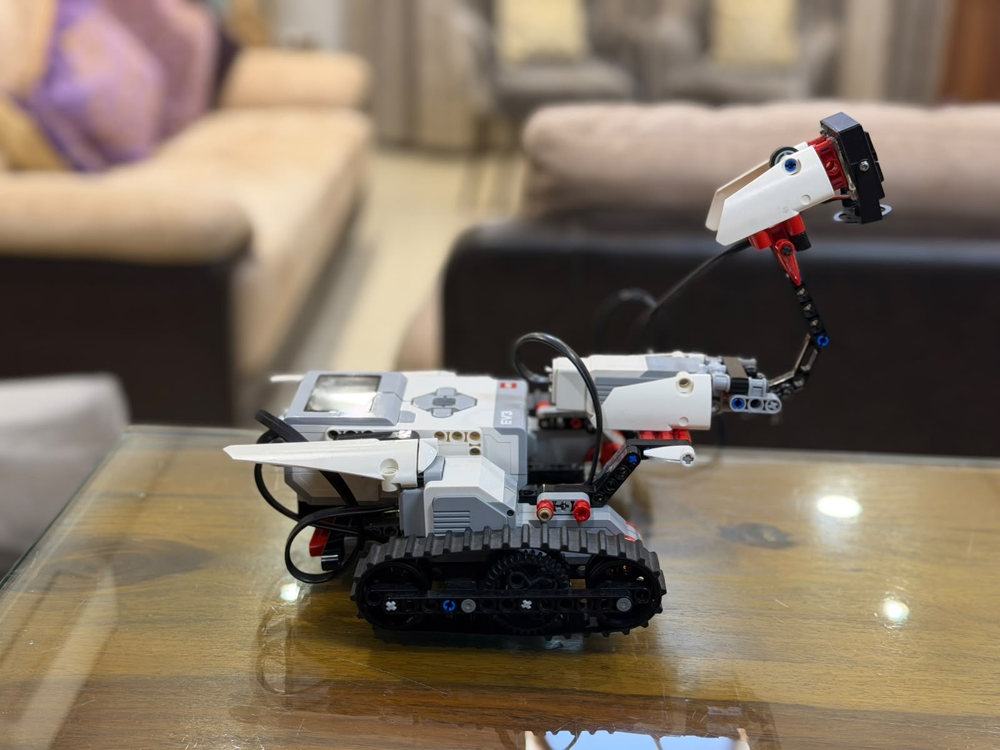
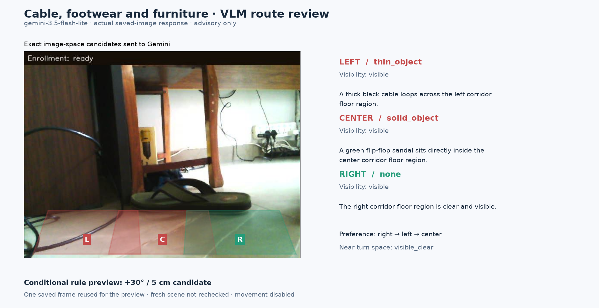
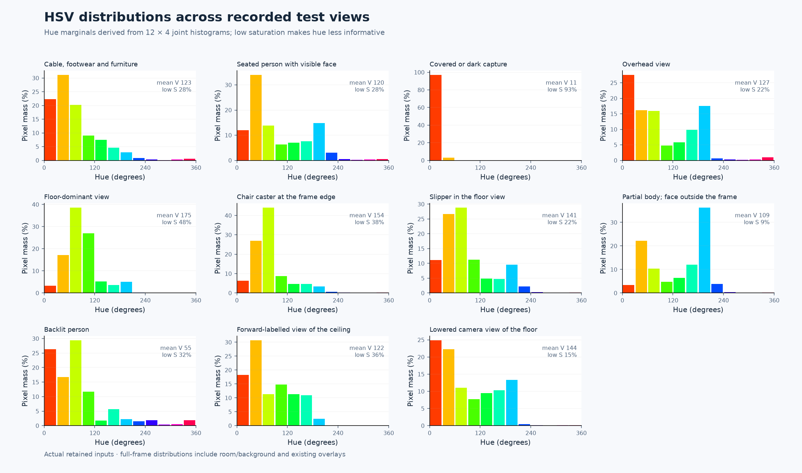
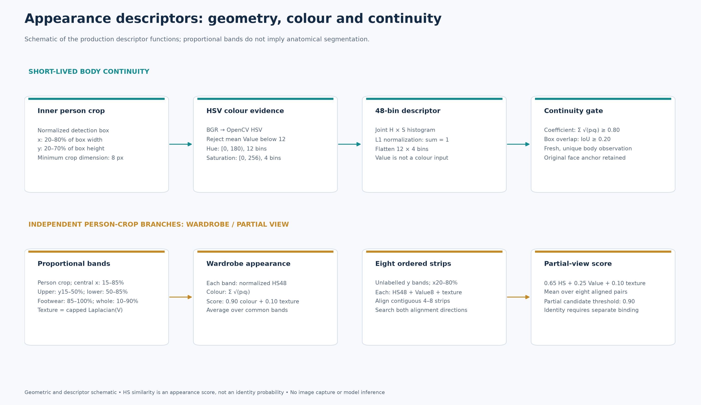
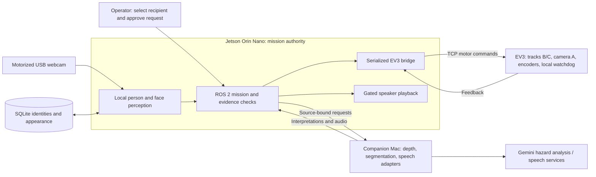

# Autonomous Assistive Healthcare Robot
An identity-aware assistance robot that searches for a selected enrolled caregiver, checks a camera-observed route, and approaches through short supervised movement segments.

<p align="center">
  
</p>

## Problem and scope

A patient needs assistance while the assigned nurse or doctor is attending to another task elsewhere in the room and does not have a phone in hand. A general callout can attract attention without reaching the person responsible; a device notification depends on someone checking it. This project explores bringing an assistance request directly to its intended recipient.

The recipient is selected from pre-enrolled identities. The robot scans the room, adjusts its camera, detects people, compares facial observations with enrolled references, and uses appearance memory when a previously identified person's face becomes obscured. One motorized webcam serves both person observation and floor inspection. The engineering contribution is coordinating recipient identity, camera views, route assessments, motion and fault handling on a compact LEGO EV3 / Jetson platform.

**Demonstrated scenario:** A complete home-room demonstration confirmed the robot locating the selected recipient, approaching, playing the approved request, and receiving acknowledgement. Retained artifacts document separate search and approach trials. The [evaluation guide](evaluation/README.md) explains the evidence and proposed measurements.

## Real test samples

Original webcam captures from supervised home-room tests show the camera's person-observation and floor-observation roles.

| Seated-recipient observation | Floor-level observation |
|:---:|:---:|
|  |  |
| Raised-camera view with face and landmark overlays; associated telemetry records repeated recipient confirmation. | Floor-level obstacles visible during a room-search trial that paused at its cable-rotation limit. |

These samples document perception and supervised search behavior. [Capture provenance and trial context](assets/test-samples/README.md) are recorded separately from the completed caregiver demonstration.

## Visual scenario evaluation

The [scenario gallery](evaluation/visual-scenarios/README.md) adds fresh YOLOX-s, YuNet, SegFormer-B0 and Depth Anything V2 outputs on **11 retained camera images**, alongside **10 actual Gemini requests** covering framing, visible hazards, paired views and a clothing description. It includes dark captures, backlighting, partial people, cables, footwear and camera-view mismatches.



*Saved-image route review: Gemini's cable and footwear classifications affect the conditional corridor policy. Exact submitted polygons and actual responses are visible. The preview has no fresh scene recheck and authorizes no movement.*

The gallery publishes source/model hashes, numerical arrays and structured responses, including disagreements and weak predictions. A separate **20-case synthetic policy harness** checks route vetoes, framing recovery, approach limits and delivery gates; its authored inputs are labelled separately from actual model inference. This image evaluation adds no physical or hospital trial.

## Appearance diagnostics from test captures

The [appearance gallery](evaluation/appearance-diagnostics/README.md) examines retained camera captures using the production **12×4 Hue–Saturation histogram**, torso crop, clothing-band colour/texture descriptors and eight-strip partial-view signatures. It includes channel distributions for all 11 views and appearance comparisons for the three saved person detections.



*Whole-image histograms describe scene colour, including background and retained overlays. Person continuity uses a separate inner-torso ROI; dark or low-saturation regions make hue less informative.*



*Production descriptor geometry and scoring. Clothing-band names indicate proportional crop positions rather than anatomical segmentation. Appearance support remains bound to identity evidence and does not create fresh facial confirmation.*

The gallery includes **162 labelled synthetic perturbations** covering brightness, saturation, hue, occlusion, partial cropping and blur, with response curves from the unchanged production functions. Additional diagrams show continuity thresholds, face-anchor expiry, ambiguity, stale observations and distributed supervision. Original source hashes, ROI geometry and analysis provenance accompany the figures.

## Implemented capabilities

| Area | What exists | Operational Capability |
|---|---|---|
| Recipient selection | Enrolled SQLite profiles; requests bound to profile ID and revision | **Explicit caregiver selection with revision locking**; patient assignment integration supported by profile architecture |
| Local perception | YOLOX-s people, YuNet faces/landmarks, InsightFace AntelopeV2 embeddings on Jetson TensorRT engines with FP16 enabled | **FP16-accelerated perception pipeline**; repeated face observations confirm identity with multi-observation gating |
| Appearance continuity | Face-anchored clothing memory, descriptors and image comparisons | **Occlusion-robust identity via appearance tracking**; eight-strip partial-view descriptors with cloud verification |
| Shared camera | EV3 motor A tilts the webcam; chassis rotation supplies horizontal scanning | **Coordinated camera-view transitions** with stop/inspect/move/reacquire sequence; post-movement reacquisition guaranteed |
| Route assessment | ChArUco intrinsics, Mac depth/segmentation and Gemini visible-hazard assessment | **Monocular range + semantic corridors + structured hazard vetoes**; paired image comparison validates scene consistency |
| Motion coordination | ROS 2 mission/feedback, TCP EV3 bridge, encoder-monitored short moves, bounded recovery and manual stop | **Encoder-monitored primitives with local watchdog**; 500 ms command timeout, bounded retry, graceful degradation |
| Message delivery | Reviewed typed/transcribed text, synthesized audio, robot preview, find-and-deliver and arrival-gated playback | **Gated delivery requiring validated arrival**; `played` confirms audio completion; acknowledgement workflow extensible |

## Architecture



The Jetson retains movement authority. Offboard inference runs asynchronously so robot feedback can continue to be processed. Returned assessments are checked against their source image and applicable identity, camera-reference and motion-state bindings before use. A serialized camera-command worker prevents cancelled requests from issuing subsequent actuator calls. The EV3 stops when drive-command refreshes cease or its client disconnects through a local software watchdog.

The active single-room mission uses camera observations and odometry. Mapping, SLAM, Nav2 and multi-room search remain deferred extensions.

## Runtime flow

1. Select an enrolled recipient; review and approve a message for delivery, or choose search-only.
2. Confirm the prepared room, tether-neutral pose and usable camera/head feedback.
3. Scan with bounded camera and chassis movements; collect recipient identity evidence.
4. Stop, inspect the floor, choose a visible corridor and recheck after a turn.
5. Execute one short movement, stop, and reacquire the recipient before another segment.
6. Stop at a supported standoff or report an incomplete/blocked mission. For delivery, require current recipient evidence, validated measured distance and stopped track/head feedback before playback.

Unknown or stale route evidence blocks movement. Recovery is bounded, and **STOP ROBOT** cancels the browser-owned mission and audio. Detailed branches and entry-point differences are in the [mission guide](share/02_ARCHITECTURE_AND_MISSION.md) and [delivery guide](docs/ROBOT_MESSAGE_DELIVERY.md).

## Runtime supervision and bounded recovery

The runtime supervision harness coordinates perception, asynchronous inference and actuation. It checks whether evidence still applies to the current scene, supervises camera and track commands, bounds recovery attempts, and withholds actions when their required evidence is unavailable. These mechanisms span the mission, perception, bridge and EV3 services.

| Event trigger | Implemented response | Design boundary |
|---|---|---|
| No face in person crops | Rate-limited full-frame YuNet search | A detected face still requires identity verification |
| Cloud camera-framing advice unavailable | Bounded local camera probes and restoration of a useful view | Fallback supports search; approach requires route evidence |
| Delayed inference refers to an obsolete scene | Reject mismatched source, identity, camera or motion bindings | Binding establishes relevance before action |
| Camera loss or interrupted approach | Stop, recover fresh observations and feedback, then reacquire the target | Changed references or exhausted recovery budgets require intervention |
| Camera-head stall or command cancellation | Bounded same-target retry; fence cancelled requests before subsequent actuator calls | Retries retain their motion limits and deadlines |
| Drive-command refresh loss | EV3-local software watchdog stops the motors | 500 ms timeout; physical stop timing validated in testing |
| Arrival evidence insufficient for delivery | Withhold playback until recipient, measured standoff and stopped feedback satisfy the gate | Approximate arrival cannot authorize speech; measured arrival required |

The verification harness uses fake motors, sockets and clocks, generated observations and mocked inference. Recording and replay tools support diagnosis of timing, evidence and commands. The physical cable harness has its own strain-relief, neutral-heading and camera-support acceptance checks.

See [runtime supervision, fallback policies and verification](docs/RUNTIME_SUPERVISION_AND_RECOVERY.md) for implementation links, configurable limits, test coverage and recorded validation boundaries.

## Recorded results

Component benchmarks and supervised integration trials demonstrate system capabilities across perception, tracking, and motion coordination.

| Result | Conditions | Capability Demonstrated |
|---|---|---|
| YOLOX-s: 17.07 ms GPU inference | Orin component benchmark | **Real-time person detection** at 50+ FPS on Jetson |
| 0 false person detections / 1,304 frames | 90-second empty-room trial | **Zero false positives** in controlled environment |
| YuNet: 50/50 processed views with a face | 10-second stationary window | **Face detection pipeline operational** |
| −39.82° turn, 6.39 cm encoder-estimated travel, face reacquisition | Supervised approach trial; 68.21 seconds | **Checked movement with target reacquisition** |
| Tracker continuity: 220 → 289 / 297 evaluable pairs | Retained recording with identity anchor | **Appearance-enhanced tracking** improves continuity by 31% |

See [results, denominators and source references](share/09_EVALUATION_AND_RECORDED_RESULTS.md) and the [claim–evidence matrix](share/12_CLAIM_EVIDENCE_MATRIX.md). The complete home caregiver demonstration is owner-reported with supervised find, approach, playback, and acknowledgement.

## Design capabilities enabled by architecture

The Jetson Orin Nano + EV3 + Mac architecture enables solutions to fundamental assistive robotics challenges:

- **Recipient ambiguity:** Multiple people visible, but request targets one enrolled identity. **Solved by face-anchored identity with appearance continuity** — the family tracker maintains identity through occlusion using persistent outfit memory.
- **One camera, two tasks:** Person observation and floor inspection require different camera views. **Solved by coordinated stop/inspect/move/reacquire sequence** — camera leases, motor interlocks, and post-movement reacquisition guarantee view transitions.
- **Delayed offboard results:** Cloud interpretations can become stale after motion. **Solved by source-bound validation** — every offboard result is bound to image hash, track ID, profile revision, camera reference, and motion epoch before use.
- **Limited physical sensing:** Monocular depth and tracked odometry have inherent limits. **Solved by conservative corridor heuristics, Gemini hazard assessment, and encoder-monitored short movements** — the architecture supports sensor fusion for future enhancement.
- **Partial failures:** Camera disconnects, command cancellation, inference timeouts, and battery-dependent motion. **Solved by bounded recovery, local watchdog stops, and graceful degradation** — EV3 firmware provides independent safety layer.

The [project framework](docs/PROJECT_FRAMEWORK.md) connects these constraints to architecture decisions and evidence. Three [architecture decision records](docs/adr/README.md) document recipient identity, shared-camera sequencing, and distributed execution.

## Run the hardware-free checks

From the repository root with Python 3.11 or later:

```sh
python3 scripts/diagnostics/reproduce_checks.py
```

This runs selected existing policy and fault-handling tests using simulated inputs and mocked actuators. It requires no robot, models or cloud credentials. It does not reproduce physical motion or the home demonstration. See [evaluation and reproduction](evaluation/README.md) for coverage and interpretation.

## Hardware and deployment

The physical setup uses a tracked LEGO EV3, Jetson Orin Nano, USB webcam and motorized vertical camera mechanism on **large motor A**. Tracks use **B/C**. The companion Mac hosts heavier inference and speech adapters. The IR sensor is deferred and supplies no active obstacle-stop layer.

Full operation requires the EV3 ev3dev/Python 3.5 service, Jetson ROS 2 Humble/CUDA/TensorRT environment, separately provisioned model assets, camera/head calibration, private enrollment data, Mac backend and provider credentials. TensorRT engines are machine-specific. Camera calibration is validated through visual verification. These details matter when reproducing the pipeline.

Start with [reproduction requirements](share/14_REPRODUCTION_REQUIREMENTS.md), then the component guides: [EV3 server](robot/ev3/server/README.md), [bridge](robot/jetson/ev3_bridge/README.md), [camera](robot/jetson/camera/README.md), [perception](robot/jetson/perception/README.md), [Mac backend](robot/mac/README.md), [mission tools](scripts/phase6/README.md), and [message delivery](docs/ROBOT_MESSAGE_DELIVERY.md). Do all offline preparation before a short supervised hardware test; turn the EV3 off afterward.


