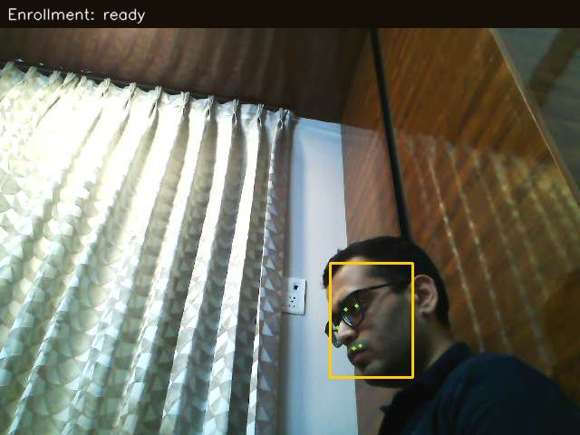
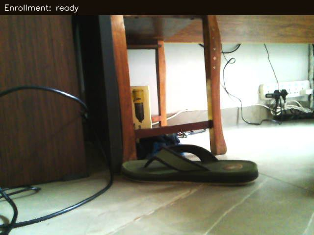
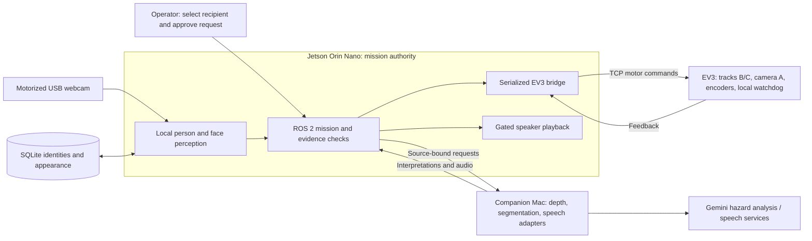

# On-Call Hospital Assistance with Recipient Directed Care Coordination

An identity-aware assistance robot that searches for a selected enrolled caregiver, checks a camera-observed route, and approaches through short supervised movement segments.

## Problem and scope

A patient needs assistance while the assigned nurse or doctor is attending to another task elsewhere in the room and does not have a phone in hand. A general callout can attract attention without reaching the person responsible; a device notification depends on someone checking it. This project explores bringing an assistance request directly to its intended recipient.

The recipient is selected from pre-enrolled identities. The robot scans the room, adjusts its camera, detects people, compares facial observations with enrolled references, and uses appearance memory when a previously identified person's face becomes obscured. One motorized webcam serves both person observation and floor inspection. The engineering contribution is coordinating recipient identity, camera views, route assessments, motion and fault handling on a compact LEGO EV3 / Jetson platform.

**Demonstrated scenario:** the project owner reports a complete home-room demonstration: the robot located the selected recipient, approached, played the approved request, and the recipient acknowledged it. Retained artifacts document separate search and approach trials; quantitative records and a recording of the complete demonstration remain to be documented. Hospital performance has not been evaluated, and acknowledgement is currently observed by the operator. The [evaluation guide](evaluation/README.md) explains the evidence and proposed measurements.

## Real test samples

Original webcam captures from supervised home-room tests show the camera's person-observation and floor-observation roles.

| Seated-recipient observation | Floor-level observation |
|:---:|:---:|
|  |  |
| **5 September 2026.** Raised-camera view with face and landmark overlays; associated telemetry records repeated recipient confirmation. | **6 September 2026.** Floor-level obstacles visible during a room-search trial that paused at its cable-rotation limit. |

These samples document perception and supervised search behavior. [Capture provenance and trial context](assets/test-samples/README.md) are recorded separately from the completed caregiver demonstration.

## Implemented capabilities

| Area | What exists | Practical boundary |
|---|---|---|
| Recipient selection | Enrolled SQLite profiles; requests bound to profile ID and revision | Caregiver selection is explicit; no hospital assignment directory |
| Local perception | YOLOX-s people, YuNet faces/landmarks, InsightFace AntelopeV2 embeddings on Jetson TensorRT engines with FP16 enabled | Repeated face observations support identity; broad recognition accuracy is unmeasured |
| Appearance continuity | Face-anchored clothing memory, descriptors and image comparisons | Clothing is distinct from fresh facial confirmation; current policy can use it for approach and delivery |
| Shared camera | EV3 motor A tilts the webcam; chassis rotation supplies horizontal scanning | Floor inspection temporarily removes the person view; reacquisition follows each approach segment |
| Route assessment | ChArUco intrinsics, Mac depth/segmentation and Gemini visible-hazard assessment | Monocular range and image corridors are estimates, not complete 3D clearance |
| Motion coordination | ROS 2 mission/feedback, TCP EV3 bridge, encoder-monitored short moves, bounded recovery and manual stop | Track slip, tether and camera reference require a prepared supervised setup |
| Message delivery | Reviewed typed/transcribed text, synthesized audio, robot preview, find-and-deliver and arrival-gated playback | `played` means playback completed; hearing, understanding and acknowledgement are separate |

## Architecture



The Jetson retains movement authority. Offboard inference runs asynchronously so robot feedback can continue to be processed. Returned assessments are checked against their source image and applicable identity, camera-reference and motion-state bindings before use. A serialized camera-command worker prevents cancelled requests from issuing subsequent actuator calls. The EV3 stops when drive-command refreshes cease or its client disconnects through a local software watchdog.

The active single-room mission uses camera observations and odometry. Mapping, SLAM, Nav2 and multi-room search remain deferred extensions.

## Runtime flow

1. Select an enrolled recipient; review and approve a message for delivery, or choose search-only.
2. Confirm the prepared room, tether-neutral pose and usable camera/head feedback.
3. Scan with bounded camera and chassis movements; collect recipient identity evidence.
4. Stop, inspect the floor, choose a visible corridor and recheck after a turn.
5. Execute one short movement, stop, and reacquire the recipient before another segment.
6. Stop at a supported standoff or report an incomplete/blocked mission. For delivery, require current recipient evidence, validated measured distance and stopped track/head feedback before playback.

Unknown or stale route evidence blocks movement. Recovery is bounded, and **STOP ROBOT** cancels the browser-owned mission and audio. Detailed branches and entry-point differences are in the [mission guide](share/02_ARCHITECTURE_AND_MISSION.md) and [delivery guide](docs/ROBOT_MESSAGE_DELIVERY.md).

## Runtime supervision and bounded recovery

The runtime supervision harness coordinates perception, asynchronous inference and actuation. It checks whether evidence still applies to the current scene, supervises camera and track commands, bounds recovery attempts, and withholds actions when their required evidence is unavailable. These mechanisms span the mission, perception, bridge and EV3 services.

| Failure trigger | Implemented response | Boundary |
|---|---|---|
| No face in person crops | Rate-limited full-frame YuNet search | A detected face still requires identity verification |
| Cloud camera-framing advice unavailable | Bounded local camera probes and restoration of a useful view | This fallback supports search; approach still requires route evidence |
| Delayed inference refers to an obsolete scene | Reject mismatched source, identity, camera or motion bindings where required by that stage | Binding establishes relevance; it does not establish model accuracy |
| Camera loss or interrupted approach | Stop, recover fresh observations and feedback, then reacquire the target | Changed references or exhausted recovery budgets require intervention |
| Camera-head stall or command cancellation | Bounded same-target retry; fence cancelled requests before subsequent actuator calls | Retries retain their motion limits and deadlines |
| Drive-command refresh loss | EV3-local software watchdog stops the motors | Default timeout is 500 ms; physical stop delay remains to be measured |
| Arrival evidence insufficient for delivery | Withhold playback until recipient, measured standoff and stopped feedback satisfy the gate | Approximate arrival cannot authorize speech |

The verification harness uses fake motors, sockets and clocks, generated observations and mocked inference. Recording and replay tools support diagnosis of timing, evidence and commands. The physical cable harness has its own strain-relief, neutral-heading and camera-support acceptance checks.

See [runtime supervision, fallback policies and verification](docs/RUNTIME_SUPERVISION_AND_RECOVERY.md) for implementation links, configurable limits, test coverage and recorded validation boundaries.

## Recorded results

These figures come from different historical component and room trials, not one end-to-end success benchmark.

| Result | Conditions | What it establishes |
|---|---|---|
| YOLOX-s: 17.07 ms GPU inference | Recorded Orin component benchmark | Local detector performance; excludes mission, camera movement and cloud time |
| 0 false person detections / 1,304 frames | One 90-second empty-room trial | A controlled negative scene |
| YuNet: 50/50 processed views with a face | One 10-second stationary window | A small pipeline acceptance check |
| −39.82° turn, 6.39 cm encoder-estimated travel, face reacquisition | Supervised September 12 approach; 68.21 seconds | One checked movement and target reacquisition |
| Tracker continuity: 220 → 289 / 297 evaluable pairs | One retained recording and one identity anchor | Offline continuity improvement on that recording |

See [results, denominators and source references](share/09_EVALUATION_AND_RECORDED_RESULTS.md) and the [claim–evidence matrix](share/12_CLAIM_EVIDENCE_MATRIX.md). Adjacent video frames are correlated; encoder travel is not independently measured physical distance. The complete home caregiver demonstration is owner-reported, without a comparable retained trial table.

## Why the design is difficult

- **Recipient ambiguity:** several people can be visible, but the request belongs to one selected identity. Similar clothing and hidden faces complicate continuity.
- **One camera, two tasks:** observing the person and checking the floor require different views. Camera transitions invalidate observations and create gaps in target visibility.
- **Delayed offboard results:** an interpretation of an earlier scene can become unusable after motion, profile changes or camera re-referencing.
- **Limited physical sensing:** monocular depth, floor masks and tracked odometry cannot establish every obstacle or stopping gap.
- **Partial failures:** camera disconnects, command cancellation, inference timeouts and battery-dependent head motion need clear stop/recovery behavior.

The [project framework](docs/PROJECT_FRAMEWORK.md) connects these constraints to alternatives, decisions, evidence, failures and open questions. Three [architecture decision records](docs/adr/README.md) explain recipient identity, shared-camera sequencing and distributed execution.

## Run the hardware-free checks

From the repository root with Python 3.11 or later:

```sh
python3 scripts/diagnostics/reproduce_checks.py
```

This runs selected existing policy and fault-handling tests using simulated inputs and mocked actuators. It requires no robot, models or cloud credentials. It does not reproduce physical motion or the home demonstration. See [evaluation and reproduction](evaluation/README.md) for coverage and interpretation.

## Hardware and deployment

The physical setup uses a tracked LEGO EV3, Jetson Orin Nano, USB webcam and motorized vertical camera mechanism on **large motor A**. Tracks use **B/C**. The companion Mac hosts heavier inference and speech adapters. The IR sensor is deferred and supplies no active obstacle-stop layer.

Full operation requires the EV3 ev3dev/Python 3.5 service, Jetson ROS 2 Humble/CUDA/TensorRT environment, separately provisioned model assets, camera/head calibration, private enrollment data, Mac backend and provider credentials. TensorRT engines are machine-specific. The checked-in ChArUco report failed automatic coverage acceptance; the calibration was subsequently adopted after a manual visual check. These details matter when reproducing the pipeline.

Start with [reproduction requirements](share/14_REPRODUCTION_REQUIREMENTS.md), then the component guides: [EV3 server](robot/ev3/server/README.md), [bridge](robot/jetson/ev3_bridge/README.md), [camera](robot/jetson/camera/README.md), [perception](robot/jetson/perception/README.md), [Mac backend](robot/mac/README.md), [mission tools](scripts/phase6/README.md), and [message delivery](docs/ROBOT_MESSAGE_DELIVERY.md). Do all offline preparation before a short supervised hardware test; turn the EV3 off afterward.

## Failure analysis and limitations

Retained failures include camera disconnection during turning, inaccurate monocular distance, loss of usable identity during floor inspection, and a depleted-battery head-motion failure. The mitigations include stopping, reconnecting, invalidating stale evidence and reacquiring the target. They do not establish reliable arrival under all conditions.

Current appearance policy can accept saved clothing without a new face observation in that mission. Hospital uniforms therefore need explicit distractor testing. The route gate uses image-space corridor heuristics, and the floor-view movement worker does not continuously observe the recipient. Watchdog timing depends on the EV3 process continuing to run. Read the [limitations](share/13_COVERAGE_LIMITATIONS_AND_OPEN_QUESTIONS.md) before generalizing any result.

## Ownership and next work

The project owner designed, implemented, integrated and tested the system, including hardware integration and evaluation. Pretrained models, ROS 2, OpenCV, TensorRT and provider services are third-party components; the project's engineering contribution is their coordinated operation, evidence handling and diagnostics. See [contribution and data boundaries](share/11_CONTRIBUTIONS_OWNERSHIP_AND_DATA.md).

Next evaluation should retain the complete home caregiver trial, test named-recipient selection with closer distractors and similar clothing, independently measure stopping gaps and fault-stop delays, and record message receipt separately from playback. Hospital trials and care-coordination benefits require their own evidence. See the [documentation reading guide](share/README.md) for the full technical dossier.
