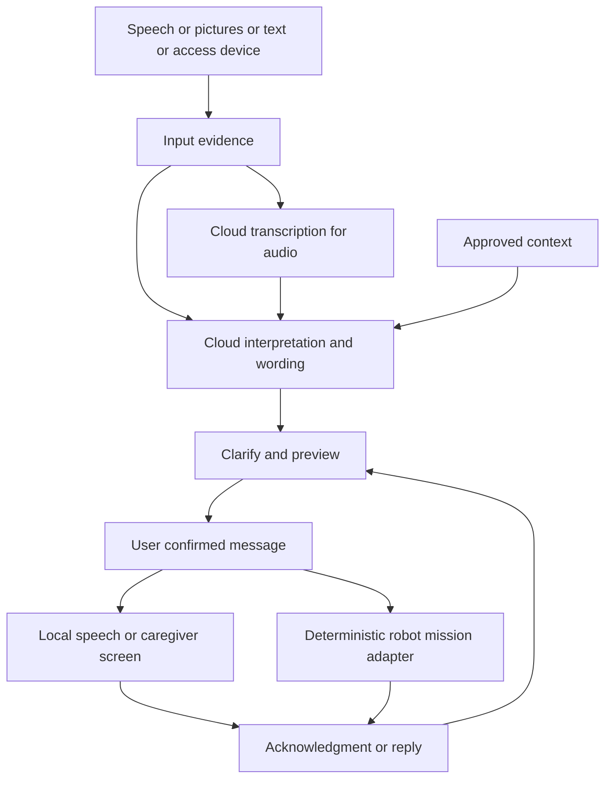

# Assistive communication and caregiver delivery plan

Build a communication companion that helps a person express what they mean, confirm the wording through an accessible input method, and reach a chosen caregiver. Start with a stationary app using cloud audio inference. Add the existing robot as a delivery channel after the communication loop works.

Planning date: 5 September 2026. Initial assumptions pending user preferences: English and Hindi/Hinglish; first participant can use touch to confirm speech. Other access methods share the same message pipeline but require separate usability validation. This is a proposed build plan, not a report of implemented or clinically validated capabilities.

Confirmed inference constraint: use inexpensive cloud models, prioritizing Gemini and Groq. If they cannot meet the communication requirements, explicitly tell the user what failed and provide examples. Do not silently upgrade to a more expensive model or provider; the user will decide the next step.

Confirmed UI direction: beautiful, elegant, light theme with Three.js and real-time application updates. Use SSE for server-to-client events in the first build, with ordinary HTTP requests for user actions and audio uploads. Reserve WebSockets for a later continuous two-way streaming requirement.

## Product outcome

The first useful demonstration is:

1. The person says a few words, types, or selects pictures.
2. The application proposes a short message that preserves their meaning.
3. If something consequential is unclear, it asks one focused question using speech, pictures, or choices.
4. The person confirms the message and recipient.
5. The application speaks it locally or delivers it to a caregiver screen.
6. The caregiver acknowledges or replies; the application presents that reply accessibly.

Later, step 5 can send the robot to find the enrolled caregiver, stop at a safe distance, and play the confirmed message. The sender retains an accessible device while the robot travels.

The distinctive hypothesis is that combining grounded message assistance, low-effort clarification, multiple access methods, and delivery with acknowledgment will reduce communication effort. The Archive already implements parts of this. Novelty over other products has not been established; evaluate the improvement rather than claim a world first.

## Relationship to the proposal

The source proposal covers speech, motor, literacy, and cognitive communication difficulties, then daily needs, social connection, information access, rehabilitation, and emotional well-being. These are connected capabilities within one platform rather than separate initial products.

| Proposal area | Implementation direction | When |
| --- | --- | --- |
| Speech and language assistance | Cloud transcription, supported interpretation, optional grammar repair and translation | First build |
| Daily needs and assistance | User-composed needs, recipient selection, delivery and acknowledgment | First build and second milestone |
| Symbol and text input | Stable picture board, short text, selectable phrases | Basic support in first build |
| Limited movement | Switch scanning, head-pointer compatibility, then calibrated gaze access | Separate access milestones |
| Cognitive communication | One step at a time, limited choices, repeat/back, optional prompts | First build, personalized later |
| Social and emotional connection | Messages such as “I would like company,” conversation participation, family replies | Early extension |
| Information access | User-requested plain-language explanations with original material available | Later |
| Rehabilitation | Exercises designed and reviewed with a speech-language professional | Separate later workstream |
| BCI | Possible research connection, outside this build | Deferred |

The document's claims about recovery and emotional outcomes are motivations, not demonstrated results. Do not implement a fixed grief-stage classifier or infer depression, intent, pain severity, or medication needs from vocal tone. A help button sends its configured help message; it does not manufacture a reason for needing help. This prototype supplements existing ways of calling for help.

## What the Archive contributes

`Archive/echora` provides a FastAPI backend, browser/mobile interfaces, immutable ASR hypotheses, contextual message candidates, audience profiles, personal vocabulary, and speech output. Its architecture deliberately separates transcription from message wording. These are useful reference boundaries.

`Archive/Echora 2.0` provides Hindi/English span handling, preservation of names and numbers, pronunciation normalization, and a separate speech synthesis layer. Reuse relevant ideas for bilingual output; transliteration must not replace the message's original evidence.

Three changes are especially important:

- The archived app can speak automatically when one candidate survives. In this system, one surviving candidate is still a draft. The user chooses “Speak” or “Send”; choosing a fully previewed option may also serve as confirmation to avoid a redundant step.
- Historical `message_chain/results/after.json` records only 25 of 40 trials with the expected selection/ambiguity decision. Some trials selected a body part or other meaningful alternative despite unresolved evidence. This is a small fixed-transcript evaluation of an archived version, not a current clinical score. Retain these failures as regression cases.
- Cloud providers may return one transcript rather than the Archive's five beams. Provider alternatives are optional. LLM-generated interpretations must never be labeled acoustic hypotheses, and neither model confidence nor agreement between related outputs proves the person's intent.

Use the Archive as reference, with selective porting after review. Do not import its training infrastructure or assume its archived provider settings still apply.

## Accessible interaction

Configure access around the person's abilities and preferences, allowing combinations and changes with fatigue. Multimodal support and confirming understanding are consistent with [ASHA communication access guidance](https://www.asha.org/practice/communication-access/) and its [AAC guidance](https://www.asha.org/NJC/AAC/).

| Access need | Input | Review and confirmation |
| --- | --- | --- |
| Speech difficult to understand | Tap to start/finish recording, replay, longer pauses | Large candidate cards, read aloud, touch or switch |
| Difficulty finding/forming words | Speech fragments plus optional symbols | Short literal wording; ask about only the missing distinction |
| Little or no usable speech | Pictures, phrase board, text | Same preview and send flow as audio |
| Reading/writing difficulty | Pictures and spoken labels | Picture-backed choices and optional audio review |
| Limited hand movement | Keyboard/switch scanning or existing head-pointer input | Adjustable dwell/scan timing, pause, undo |
| Severe movement restriction | Individually calibrated gaze device/adapter | Deliberate selection and cancellation; no assumption that blinking is reliable |
| Hearing difficulty | Text, captions, visual status | Visual choices and explicit delivery state |
| Low vision | Screen reader, large text, high contrast | Spoken preview and keyboard/switch controls |
| Attention or processing difficulty | One question at a time, predictable screen | Few choices, repeat/back, no response deadline |

Aphasia should not be treated as merely slurred speech. Better transcription alone may leave an intended message unclear, and longer grammatical sentences may make review harder. Work with the intended user and, where available, a speech-language professional on access and comprehension.

Keep essential buttons and the core symbol grid in stable positions. Put contextual suggestions in a separate area; freeze their order while someone is scanning or selecting. Provide “None of these,” “Use my original words,” and “Cancel.” Start/finish recording can be toggled so sustained pressure is unnecessary. Silence or inactivity is never confirmation.

## Context and enrichment

Maintain four separate records: input evidence, proposed meaning, rendered wording, and confirmed message. A transcript is a model hypothesis about speech, not ground truth. Preserve it unchanged while the draft evolves.

Use context progressively:

1. Current speech, typed words, and explicit symbol selections.
2. Explicit answers within this message, including recipient and intended action.
3. Recent user-confirmed turns with speaker, time, and expiration.
4. Approved profile details such as vocabulary, relationships, and language preference.
5. Situational clues such as a selected room or optional pointed-at object, used to suggest questions rather than assert personal needs.

Track each added detail's source, time, and whether it is confirmed. Current explicit input overrides historical preferences. Caregiver-entered information stays labeled as such and must not silently override the sender. AI drafts never become memories by themselves; saving a repeated preference is a separate user-controlled operation.

Offer three wording choices as needed: original/minimal, natural phrasing, and translated output. Natural English is optional; preserve Hindi/Hinglish or another preferred language. Preview in a language and form the person can understand.

Example:

- Input: “Meena… water…”
- Proposal: “Meena, please bring me water.”
- Optional clue: profile says the person sometimes prefers warm water.
- Question: “Warm or room temperature?” with “No preference” and “Cancel.”
- After a selection and final confirmation: “Meena, please bring me warm water.”

Never add “I am dehydrated,” a quantity, a location, or urgency merely because it sounds plausible. For “leg… hurt,” clarify a body part if uncertain, but allow the person to send a short pain message without answering optional severity questions. Preserve negation, numbers, names, body parts, time, and request-versus-statement distinctions.

## Cloud audio architecture

Use cloud inference for audio and language understanding as requested. Keep recording controls, message state, profile storage, and delivery orchestration local initially. The Mac hosts development; the Jetson can later host the lightweight service without taking over audio inference.

Benchmark two inexpensive cloud approaches on the same consented examples:

| Candidate | Role | Decision criterion |
| --- | --- | --- |
| Groq `whisper-large-v3-turbo` followed by `openai/gpt-oss-20b` on Groq | Separate cloud transcription and inexpensive contextual drafting | Inspectability, meaning preservation, correction effort |
| Gemini `gemini-2.5-flash-lite` | Inexpensive direct audio interpretation or text drafting with bounded context | Whether direct audio access improves actual communication outcomes at low cost |

Official list prices checked on the planning date: Groq Whisper Turbo is $0.04 per audio hour; GPT-OSS 20B on Groq is $0.075 per million input tokens and $0.30 per million output tokens. Gemini 2.5 Flash-Lite standard pricing is $0.10 per million text input tokens, $0.30 per million audio input tokens, and $0.40 per million output tokens. These are inference unit prices, not a complete application estimate; account access, billing minimums, retries, and speech output still need checking. Model suitability for the intended speakers remains untested. Sources: [Groq speech transcription](https://console.groq.com/docs/speech-to-text), [Groq models and pricing](https://console.groq.com/docs/models), [Gemini pricing](https://ai.google.dev/gemini-api/docs/pricing).

Groq's text model receives the transcript rather than raw audio; Whisper handles the audio input. Gemini Flash-Lite provides the direct audio-model comparison. Start with the cheaper listed 2.5 Flash-Lite rather than assuming a newer Flash-Lite is cheaper. If it is unavailable, report that explicitly before selecting a more expensive replacement. This shortlist supersedes the earlier OpenAI transcription and larger Gemini recommendations.

Start implementation with the Groq path and completed utterances. Add the Gemini adapter for comparison, not a multi-provider request for every message. If an audio-aware model also drafts wording, its claimed transcript and evidence attribution are still generated outputs. Prefer the separated path initially, and promote direct interpretation only if evaluation supports it. Keep context, output length, reasoning effort where supported, and retry count bounded. Disable automatic escalation to larger models.

Avoid a hard-coded assumption about five beams, word timestamps, or calibrated probability. Preserve whatever evidence each API actually provides and clearly distinguish absent fields. Pin provider/model versions where available and log the actual model and prompt version used. Validate the shortlisted text models during implementation; Fish Audio is the preferred later expressive speech-output provider, subject to language, quality, latency, and cost checks.

Start with explicit recording completion because long pauses must not end an utterance prematurely. Application status and available model output stream through SSE from the first build; continuous microphone streaming is a later experience improvement. Store API keys only on the backend, send only necessary profile context, and make cloud processing visible. Raw audio retention is off by default beyond processing; optional evaluation recordings need explicit consent and deletion controls. Provider retention settings must be verified before participant audio is used.

If inference fails, retain an editable draft locally and offer fixed phrase buttons, text, and previously cached speech where available. Do not pretend an inferred message was delivered. This fallback does not introduce local LLM audio inference.

Report access errors, rate limits, excessive latency, transcription failures, and meaning-changing drafts separately. For inadequate quality, provide the input, expected meaning, actual output, model/version, and the relevant evaluation result. State explicitly when the inexpensive candidates are insufficient; do not hide failures behind fluent rewrites, lower the acceptance criteria, or spend on a stronger model without the user's direction.

## Expressive text to speech — later-stage inference

Fish Audio integration slice: server adapter and voice selector implemented,
requesting `s2.1-pro-free` explicitly. Generation requires the current confirmed
message and delivery; audio is held only in memory, cached for replay, cancelled
on stop, and rejected for stale confirmations. SSE reports generation state and
the globe reacts to actual audio playback. There are no automatic retries or
paid model substitutions. Local tests use mocks; a Fish API key and chosen voice
ID are still needed to validate real synthesis and bilingual sound quality.
The current official pricing page lists the free model at $0, but an older launch
post names an August 31 deadline, so account access must be checked explicitly.
Voice/facial cue inference remains deferred; tone is chosen by the user.

Progress, 5 September: webcam gaze trials are paused after inconsistent repeat results. Mac Head Pointer was tested with dwell selection, then turned off at the user's request. Standard controls are active. Explicit Neutral/Warm/Cheerful/Firm choices and the shared speaking-pace setting now sit beside the message. Confirmation records delivery separately from wording and pronunciation; changing delivery requires a new confirmation. Device playback applies only the confirmed pace. Tone synthesis, Fish Audio integration, and voice/face cue inference remain pending.

Add high-quality cloud text to speech with **Fish Audio as the preferred provider**. Prioritize the input, transcription, contextual drafting, confirmation, and accessible UI first. Expressive speech and optional voice/facial expression cues must be built before robot delivery; the caregiver screen is deferred and is not a prerequisite. Milestone A needs basic readable playback through an available device/browser voice; integrating Fish Audio and running voice/facial expression inference are deferred work, not prerequisites for the first slice. Device playback does not replace the required cloud audio understanding.

Keep **what the person says** separate from **how they want it spoken**. Build a speech delivery profile from the exact confirmed message, output language, preferred voice, speaking pace, emphasis, pauses, and a user-reviewable tone. Start with accessible UI choices such as neutral, warm, cheerful, or firm. A person who cannot speak or use a camera gets the same expressive controls through text, symbols, or their access device.

Later, optionally use a cloud model to suggest delivery from vocal expression in the original recording and/or facial expression captured through the app camera. Treat these as uncertain cues about delivery, not established internal emotions. Do not assume facial movement or speech patterns reliably express mood for every disability. Explicit user tone choices override inferred cues; absent, conflicting, or unreliable cues fall back to the person's chosen default. Offer a simple editable suggestion, such as “Speak this gently,” rather than automatically declaring “You are sad.” Camera analysis is opt-in, visible while active, and unnecessary for the core flow; avoid retaining raw video by default.

Example: “Meena, please sit with me” remains exactly that message. The person may choose a warm, slower delivery, or accept a suggested tone based on the current input. The system must not add “I am lonely,” invent urgency, or add crying/laughter because a model inferred an emotion. Expression cues enrich synthesis context; any proposed wording change still goes through the existing draft and confirmation flow.

Pipeline: **confirmed text + user-approved delivery settings → provider adapter → Fish Audio synthesis → optional local preview → explicit speak/send → playback status**. Keep provider control tags outside the stored message text. Bind generated audio to the confirmed message version and delivery settings; edits invalidate the corresponding audio. Provide stop, replay, and neutral-tone controls. Never synthesize or play provisional streamed wording as a final message.

Fish Audio documents emotion/style controls, with model-specific syntax: S1 uses parenthesized controls, while S2-Pro supports natural-language bracket cues. Keep that mapping inside the adapter and select the actual model at integration time rather than promising identical control across versions. See [Fish Audio model and expression controls](https://docs.fish.audio/developer-guide/models-pricing/models-overview). Provider synthesis controls do not establish that Fish Audio itself can recognize emotions from a face or recording; cue inference is a separate, unvalidated capability.

Use the existing SSE stream for synthesis-started, audio-ready, playback-started/ended, and failure events, with audio delivered through an HTTP response/stream. Add provider-side WebSocket streaming only if measured playback latency justifies it. Drive the Three.js speaking globe from actual playback. Surface synthesis failures explicitly and offer the basic voice; do not silently change providers or spend on a more expensive model.

Before enabling inferred expression, compare neutral playback, user-selected expression, and cue-assisted expression with the intended users. Check intelligibility, exact meaning, names/numbers and bilingual pronunciation, tone appropriateness as judged by the speaker, correction effort, time to first audio, and cost per message. Evaluate voice and face cues separately, including conflicting and unavailable cues. Choose a powerful synthesis model for demonstrated benefit within an agreed budget; the cheap Gemini/Groq policy remains in place for transcription and wording. No Fish Audio or emotion-inference quality, pricing suitability, or account access has been tested yet.

## Visual design and real-time interaction

**Implementation direction updated after the first preview:** the user selected [Bruno Simon’s Organic Sphere](https://github.com/brunosimon/organic-sphere) as the visual reference. Make the globe the centre of the page, with orange `#ff3e00` and electric blue `#0063ff` lighting, a dark sculptural core and flowing surface detail. Keep the overall app light, with muted neutral controls and the message editor beneath the globe. This supersedes the earlier ivory/sage split-panel composition and the three generated theme proposals. Following further user feedback, use the reference’s actual sphere shaders, geometry, light parameters and bloom rather than an approximate shader. Preserve attribution, adapt the glow for the light app, and keep microphone motion noise-gated so idle and silent listening remain still. Core functionality continues while visual refinements are tested.

Use React and Three.js for a calm, polished light interface. The proposed palette is warm ivory (`#F7F5F0`), white surfaces, deep slate text (`#253B3A`), and restrained teal (`#27645D`) with pale sage and muted peach accents. Verify contrast in the implemented screens. Use generous spacing, readable typography, softly rounded cards, subtle borders, and restrained shadows.

The main screen centers one clear action: speak, select pictures, or type. Keep the message preview and recipient visible, with an understated progress area for listening, interpreting, clarification, and delivery. On a phone, stack these into a single column; on a tablet, use the extra space for the message and recipient without shrinking touch controls. The caregiver screen uses the same visual language with a prominent message and acknowledgment action.

Make a real Three.js-rendered input globe the centerpiece of the voice screen, taking visual inspiration from the fluid voice interfaces the user associates with Apple and OpenAI. Use a distinctive pearl, teal, pale blue, and soft peach treatment on the ivory background. Use a rounded volumetric form, gently flowing surface detail, soft illumination, and smooth transitions between states. The globe should feel dimensional and responsive. Build its geometry, materials, lighting, and animation in Three.js, with a lightweight custom shader where useful.

| Globe state | Appearance and motion | Source of truth |
| --- | --- | --- |
| Idle | Pearl-like globe with very slow surface drift | App ready state |
| Listening | Soft ripples and restrained expansion responding to sound level | Actual local microphone amplitude, smoothed to avoid jitter |
| Processing | Flowing bands travel around the globe at a calm pace | Active backend job; no invented percentage |
| Needs clarification | Motion settles, with a gentle accent around the globe | A completed clarification event and visible choices |
| Speaking | Surface pulses in time with actual playback where measurable | Audio playback state and output amplitude where available |
| Finished | Brief settling transition back to rest | Confirmed completion event |
| Unavailable or error | Globe rests; nearby text explains the problem | Microphone, provider, connection, or playback error |

Microphone animation runs locally so it remains immediate; SSE drives processing, clarification, and delivery state. Do not infer emotion or intent from amplitude. Keep one persistent renderer and interpolate between states to avoid flashes or resets. A later small robot illustration can reflect reported mission state. Essential text, buttons, focus, and interaction remain semantic HTML outside the canvas. Provide an accessible start/stop control associated with the globe, and keep symbol and typing entry equally easy to reach. Status always has a text equivalent; animation never implies progress or success that the backend has not reported.

Respect reduced-motion preferences, offer a static fallback when WebGL is unavailable, pause rendering while hidden, cap pixel density, and avoid heavy post-processing. Keep animations away from symbol selection and confirmation so cards remain stable. Record GPU use and interaction responsiveness on the intended phone/tablet; decorative rendering must not compete with recording. See [Three.js responsive rendering guidance](https://threejs.org/manual/en/responsive.html).

Use one authenticated SSE connection per active application session to carry transcription progress, draft updates, clarification requests, delivery state, caregiver replies, and robot status. SSE fits these mostly server-to-client updates; it is not a claim that SSE is universally faster than WebSockets. Recording uploads, confirmation, cancellation, and acknowledgments use ordinary HTTP requests. See [MDN EventSource](https://developer.mozilla.org/en-US/docs/Web/API/EventSource).

Each event carries an event ID, job/message ID, revision, type, and timestamp. Support reconnect with a bounded replay buffer and event-ID deduplication; if the replay window is lost, fetch an authoritative state snapshot. On reconnect, restore state without resending a message or replaying spoken audio. Keep heartbeats, disable proxy buffering, scope events to the authorized sender/caregiver, and use HTTP/2 where supported. Native EventSource authentication can use same-origin secure session cookies; do not put API keys or long-lived tokens in event URLs.

Stream partial text only when the provider actually supplies it, label it as a draft, and freeze a completed version for confirmation. If the provider returns only a final transcript, show truthful processing state rather than fake token streaming or progress percentages. Coalesce frequent visual changes; screen readers announce meaningful state transitions rather than every token. SSE carries application events, not raw audio or video. Add WebSockets only if continuous bidirectional audio or another measured requirement justifies them.

## Implementation boundaries

Use one communication service with modules for input, provider adapters, context, message drafting, confirmation, and delivery. Reuse the Archive's FastAPI/React patterns where useful. A local SQLite store can hold profiles, confirmed message versions, and delivery events; an event-driven state machine is sufficient. ROS belongs only at the robot adapter boundary.

Proposed new area: `communication/`, containing `backend/`, `frontend/`, and `evals/`. Keep robot-specific delivery in `robot/jetson/mission/`. This plan does not change existing motion code or the robot roadmap.

Core records:

- Input: utterance ID, modality, time, speaker/profile, raw transcript, optional acoustic alternatives, source selections, provider metadata.
- Draft: proposed meaning, candidate text, unresolved distinctions, supporting input/context IDs, explicit additions, output language.
- Confirmation: immutable draft version, exact text, recipient, channel, timestamp, selected access action. Editing invalidates the old confirmation.
- Speech delivery: confirmed message version, voice/language, tone/pace/emphasis, cue source and uncertainty when available, user selection/override, synthesis provider/model, audio reference, and playback state. Inferred cues stay separate from confirmed message facts and are not automatically saved as profile emotions.
- Delivery: message ID/version, target ID, state, expiry, acknowledgment and reply. Retries reuse the same ID so delivery can be deduplicated.

The language model drafts and clarifies. Application code controls state transitions, allowed recipients, expiry, and dispatch. Speech, document contents, profile notes, and model output are data; they cannot change application permissions or issue motor commands.

## Build milestones

| Milestone | Deliverable | Exit check |
| --- | --- | --- |
| A — First stationary slice | Light React/Three.js UI with SSE updates; record/upload, cloud transcript, one draft or a few choices, clarify, confirm, basic device/browser speech; text and small symbol board | Complete a need, a social message, and an ambiguous message without inventing details; reconnect without duplicate send/playback; usable with reduced motion and without WebGL |
| B — Context and language | Reviewed profile, recipient selection, bounded recent context, optional English/Hindi/Hinglish output | Profile conflicts and rejected suggestions do not leak into the sent message |
| C — Expanded access | Single-switch path, screen-reader testing, head-pointer compatibility; gaze trial separately | Target user completes the full flow using the chosen access method |
| D — Expressive speech and optional cues | Fish Audio with explicit tone controls, then optional cloud voice/facial cue suggestions reviewed by the speaker; complete before robot delivery | Intelligible, faithful output and speaker-approved delivery; cues can be disabled or overridden; failures and measured cost are explicit |
| E — Stationary robot relay | Jetson receives a confirmed message and plays it; simulated search outcomes | No message playback before confirmation; no false acknowledgment |
| F — Supervised robot delivery | Find enrolled caregiver in one prepared room, stop, identify, play, receive response | Search failure, loss of target, cancellation, and robot fault return truthful status |
| G — Broader use | More participants, social features, optional curated information and rehabilitation workstreams | Per-user usefulness demonstrated before widening claims or navigation scope |
| Deferred — Caregiver screen | Paired caregiver screen, delivered/acknowledged states, fixed replies and reviewed free-text reply; excluded from current implementation scope | Revisit only when requested; do not block context, expression or robot development on this screen |

The first implementation batch should finish A. Build the recording screen and backend together; define message versions and the confirmation gate first; add the provider; then run ambiguity and pause cases before tuning style. Next is context and personalization. Expressive cloud TTS and optional emotion-cue inference follow the core communication/access work and precede robot delivery. The caregiver screen is out of the current scope. No EV3 power is needed through D or for simulated parts of E. Hardware tests should be short and prepared, followed by powering the EV3 off.

## Robot delivery

The current repository reports deployed recognition and a supervised bounded target scan. It also records unresolved camera support/calibration issues, a tether limit, deferred IR, and incomplete approach validation. Therefore whole-home caregiver search is not an available delivery guarantee.

Add a high-level `DeliverMessage` request containing a confirmed message version, known caregiver ID, and expiry. First adapt the existing enrolled-target mission; arbitrary recipient names do not create new face identities. On finding someone, stop and recheck identity before announcing private content; use a paired caregiver screen for recipient confirmation where needed. Do not treat a face match as acknowledgment.

Use explicit states: queued, searching, recipient located, ready to play, played, acknowledged, replied, failed, expired, and cancelled. A caregiver saying or selecting “I'm coming” is reported as their reply, not as completed assistance. If the caregiver is absent or the route is blocked, stop and report failure; any alternate delivery channel must already be selected or configured by the user. A generic help request should have an immediate non-robot route rather than depend on search time.

The Jetson retains deterministic perception/navigation and the EV3 retains motor control and local stops. Cloud output never publishes velocity commands.

## Evaluation and practical success measures

Begin with about 50 distinct message cases: daily needs, names, bilingual fragments, long pauses, negation, competing meanings, silence/noise, context conflicts, and social messages. Keep prerecorded synthetic/role-play checks separate from real participant results. Obtain the participant's intended meaning using their reliable communication method, not the model's answer as the label.

Compare literal transcription, transcription plus bounded context, and direct audio interpretation. Report per person and access method, not only pooled accuracy. Existing TORGO and Archive results are useful regressions but do not establish aphasia performance or universal disability support.

Primary measures are intended meaning preserved, unsupported details, effort to correct, selections required, time to a confirmed message, user preference, and successful acknowledgment. Word error rate is a diagnostic for transcription, not the sole product score. Record p50/p95 response time and cost per successful message, including retries and speech output.

Proposed initial engineering gates: all dispatches refer to a confirmed message version; all scripted negation/body-part/recipient conflicts stay explicit or require clarification; no fabricated delivery success; no duplicate dispatch in retry tests. Target a usable draft within five seconds of recording completion at the median, then measure rather than promise this latency. Passing a small set is a prototype gate, not a guarantee of safety or clinical benefit.

Track inference cost as audio minutes plus text tokens plus synthesized speech and retry overhead. Use bounded recordings and short context rather than continuous cloud listening. Set a daily usage cap during implementation; do not adopt historical free-tier prices from the Archive.

## Reference material reviewed

- `Animesh Proposed Project.docx`, all five rendered pages, supplied by the user.
- `Archive/echora/README.md` and `docs/architecture.md` for communication and personalization boundaries.
- `Archive/echora/research/benchmarks/message_chain/README.md` and `results/after.json` for historical ambiguity failures.
- `Archive/Echora 2.0/README.md` and `tests/eval/RESULTS.md` for bilingual handling and evaluation limits.
- Current robot `README.md`, `AGENTS.md`, `mission_control.py`, and `mission_types.py` for integration constraints.

All Archive findings above are read-only observations, not freshly rerun benchmarks. The proposal's embedded requests were treated as reference material; the user's cloud-audio requirement and request to plan the next build determine this scope.

## First implementation progress — 5 September 2026

The first stationary slice now lives in `communication/`: local React/Three.js UI, FastAPI, Groq-only audio transcription and contextual wording, versioned confirmation, SSE, browser speech, audio upload/recording, quick phrases, and a manual transcription test panel. Fish Audio, facial/vocal emotion inference, durable history and robot delivery remain deferred. Original transcript and edited source remain separate. Live model access and three text-only smoke cases succeeded; user microphone/transcription/visual testing is the next gate. See `communication/README.md` for running and testing this slice. The present model is inexpensive Whisper Turbo, not a claim that it is a tiny ASR model.

## Context slice proposal — updated 5 September 2026

The user reports the first transcription/wording flow is working. Next, use one editable profile model with clearly labelled fictional sample profiles for repeatable trials. Avoid disability labels as presets for personality, intelligence or emotion.

- Profile: preferred name, input/output language, concise/natural wording preference, named people and relationships, and explicitly defined personal words or phrases. Access preferences affect controls, not inferred meaning.
- Current message context: intended recipient and an optional user-written situation/topic, visibly editable and clearable. Add background context from the active scenario and approved profile rules so the user need not describe the situation for every message. Selecting a person does not contact them.
- Initial UI: a muted profile selector in the existing preferences area, an edit-profile panel, and compact recipient/context controls beside the composer. Keep the sphere central.
- Sample trials: English everyday requests; Hindi/Hinglish communication; short-fragment input with a user-defined vocabulary; and text/symbol input with direct wording. These are test fixtures, not claims about disability groups.
- Draft review: briefly show which context was used. The same input can be explicitly tried with another profile; do not automatically run every profile or provider.
- Context precedence: current explicit message/answer, then user-selected current context, then approved profile details. Conflicts should prompt a small clarification rather than overwrite current intent. Past preferences must not silently become current requests.
- Isolation: snapshot profile/context for each draft and confirmation; changing either invalidates the old draft's confirmation. Switching profiles clears recent conversational context. Original transcription remains unchanged.
- First slice excludes automatic memory. Subsequently offer an explicit toggle for a small, expiring window of confirmed messages only; rejected or unconfirmed drafts never enter it. Save stable preferences only through explicit profile edits.
- Keep the current inexpensive cloud wording model and send only relevant context. Report failures with examples; do not silently upgrade.

This records the proposed context design; profile/context implementation has not yet been added.

### Background situational context — Archive-inspired refinement

The user requests implicit context as well as explicit situation text: for example, “tea” can become “Please bring me tea” at home and “Please bring me Lipton green tea” outside. Treat this as a conditional, user-approved personal wording rule, not a brand inferred from being outdoors.

Archive sources inspected (read-only, not freshly executed):
- `Archive/echora/backend/app/personal/profile.py`: setting-scoped personal wording, audience relationships, and per-audience known details.
- `Archive/echora/backend/app/personal/personalizer.py`: setting/audience resolution and omission of details a selected audience is recorded as knowing.
- `Archive/echora/docs/roleplay-scripts.md`: the same tea fragment across home, care and outdoors, including Lipton details and changes in listener.
- `Archive/echora/frontend/app/page.tsx`: optional matching of saved places using browser location, idle-only updates and manual overrides.

Proposed context combines independent fields: **speaker profile + place/scenario + listener + current activity + current words**. Place alone must not determine who is listening, what they know, or whether the speaker wants a purchase rather than a prepared drink.

Initial scenario presets: Home, Café, Shopping, Care, and General/Unknown. These persist for the current session until changed or expired, so users do not re-enter them for every message. Each profile can define multiple conditional wordings for the same anchor. Explicit current words and corrections always win.

Example trial profile (fictional; not automatically saved as the user's preference):

| Input | Background context | Proposed wording |
| --- | --- | --- |
| tea | Home; familiar listener explicitly recorded as knowing the preference | Please bring me tea. |
| tea | Café; staff; approved usual order is Lipton green tea | Could I have Lipton green tea, please? |
| tea | Home; new helper; approved preference is Lipton green tea | Please bring me Lipton green tea. |
| tea | Outside with a companion; approved outside-tea rule | Please bring me Lipton green tea. |
| tea | Shopping; no confirmed intent to buy a packet or order a drink | Ask which action is intended; do not invent quantity or package size. |
| black tea | Any setting; saved preference is green tea | Use black tea; do not substitute the preference. |

Two strengths of saved context: a general preference can suggest a choice; an explicit “use these words in this situation” rule can enrich the draft directly. Both remain reviewable before speech. A compact note identifies additions (for example, “Lipton green tea — your café preference”), with a one-action plain-wording alternative. Do not require a separate confirmation for every approved rule before the existing final message review.

For testing, reuse the profile selector plus scenario chips in the existing UI; no caregiver screen. Run a single selected scenario per request. Include unfamiliar visitors at home and familiar companions outside so place is not confused with listener knowledge.

Automatic context follows the manual scenario tests: opt-in saved-place detection may activate an unambiguous place match, display its source, and yield immediately to a manual override. Keep coordinate matching local and send only the resulting semantic setting to the wording service. Poor accuracy, overlapping places, stale fixes or no match produce Unknown or a suggestion, not an assumed café. Freeze context for the message while recording/drafting/reviewing. In the first slice, remembered session context and approved conditional wording provide implicit enrichment without requiring location permission or camera inference.

Later confirmed conversation can resolve references such as “that one,” with explicit limits and expiry; time-of-day or camera cues can suggest situations but cannot manufacture a current need. Keep inferred context separate from confirmed profile facts. Retain the current app's explicit confirmation, honest provider errors and original transcript; do not copy the Archive's automatic candidate playback, silent personalization failures, or unavailable ASR beam-confidence assumptions.

Implementation order within B: profiles and multiple scenario-specific wording rules → current scenario/listener controls and visible context trace → fixed-input scenario comparisons on the existing cheap model → optional place detection → bounded confirmed-message context. No profile/scenario implementation is claimed complete by this plan update.

## Context implementation progress — 5 September 2026

First context slice is implemented in `communication/`: three fictional sample profiles and editable local SQLite personal copies; setting chips; independent recipient/listener selection; optional explicit situation; approved setting-scoped wording rules with automatic/ask-first modes; English/Hindi-Hinglish output; visible draft context and applied details; original-word alternative; immutable context/confirmation snapshots. Scenario changes restore source words and invalidate old confirmation. Existing audio recording/transcription and model choice are retained. Nineteen backend tests and frontend type/lint/build checks pass; live synthetic tests and corrections are recorded in `communication/evals/context-smoke-2026-09-05.json`. User testing of this slice is next.

Automatic place detection, listener-specific suppression of known details, conversation memory and richer semantic/multilingual vocabulary matching are not yet implemented. First-slice substitution uses bounded unqualified-word matching rather than assuming ASR confidence data we do not receive. Accessibility expansion is parked while the user prioritizes the main communication aim. Emotion cues/Fish Audio remain before robot delivery; the caregiver screen remains deferred.

## Profile refinement — 5 September 2026

User rejected basic profiles as insufficiently personal. Implemented editable personal introductions, wording manner, richer fictional sample lives (Asha, Kabir, Leela), always-available blank profile creation and custom moments. Each moment combines a user-named situation/setting, exact cue and explicit full message; it activates only for that cue in the chosen moment, never just because a routine is selected. Saved same-language messages need no extra model inference, while translation remains with the inexpensive cloud model. Current explicit words and final confirmation retain priority. Existing custom profiles are preserved. Introductions are display-only; biography is not converted into assumed needs. Twenty-three backend checks and frontend validation pass; user review is next.

## Hinglish reuse implemented — 5 September 2026

Following the user's approval, integrated the archived speech core in an independent vendored package with source hashes (Archive itself unchanged). Dedicated pronunciation preparation now separates readable message text from transliterated/normalized speech text. The original lexical fast path, selective Hindi conversion, English guard, names/URLs protection and pronunciation normalizer are reused. Ambiguities use the current Groq 20B model without automatic fallback. Preparation has SSE states, explicit preview, revision-bound confirmation and invalidation on edits/context changes.

154 backend tests and frontend checks pass. The new 20B smoke comparison scored 31/33 span labels on 15 selected existing gold sentences, with known slang/structural-label misses and one schema failure corrected by a closed-ID reminder. This limited mixed-before/after-adapter test does not establish parity with 120B or participant performance. Live full-pipeline preparation preserved English words in a mixed Hindi-English sentence and kept the reviewed text unchanged. Next is the user's pronunciation/listening test; Fish Audio and emotion work remain before robot delivery.

## Unified wording and speech flow — 5 September 2026

“Help me phrase it” now runs contextual drafting followed automatically by Hindi/Hinglish pronunciation, then presents one message for review. “Confirm & speak” uses that revision, or prepares freshly edited/direct input before playback. Speech details are optional and collapsed; the standalone pronunciation controls are removed. English output skips Hinglish preparation and clarification waits until resolved. Failed preparation keeps the message and offers retry or explicit speech as written. Cancellation prevents a pending confirmation from playing. Validated with 160 backend tests and frontend type/lint/build checks; user listening test is next. Browser TTS remains temporary, with emotion/Fish Audio ahead of robot delivery.

## Expanded access moved ahead of expression — 5 September 2026

Per the user's updated priority, the accessibility panel is implemented before emotion/Fish Audio. It contains saved display/motion/target-size/pace choices, labelled phrases and an on-screen keyboard, adjustable pointer dwell, and single-key switch scanning with dropdown/field handling. Existing screen-reader/keyboard semantics are extended. Input methods remain opt-in per session.

The user selected this computer's webcam for trials. Added local worker-based head-pointer and approximate iris-gaze mapping, nine-point calibration, three independent validation points, practice-before-selection, dwell activation, stale/missing/multiple-face checks, pause/stop and camera cleanup. These experimental controls require the user's real-world test; they are not validated replacements for dedicated assistive trackers. External hardware that supplies an ordinary system pointer or configured keyboard key can use dwell/scanning. Other access hardware/protocols need individual integration and participant testing.

Six selection/calibration/preference logic tests and frontend type/lint/build checks pass. Next: user head-control trial, then gaze and switch/keyboard flow, followed by screen-reader/large-text usability checks. Expression/Fish Audio remains before robot delivery; caregiver screen stays deferred.

Webcam gaze follow-up: after the simple calibration failed for the user, replaced its gaze UI path with WebGazer 3.5.3 and a four-choice board. Timed calibration, independent per-tile validation, explicit enable and reviewed message selection are implemented; local processing and no persisted calibration are preserved. Ten logic/regression tests and frontend/build checks pass; participant accuracy remains unverified. Next is the user's four-tile score, not a claim of reliable eye-control access.

## Expression progress — 5 September 2026

Fish Audio playback is working according to the user, with their selected Calm Bilingual Voice. Added optional, explicit analysis of the current recording using Gemini 2.5 Flash-Lite. Acoustic delivery cues propose a manual-review tone; uncertain audio can yield no suggestion. Accept/dismiss precedes the existing Confirm & speak flow. Words, pronunciation, pace and confirmation are not automatically changed by inference. Camera cues and robot delivery remain deferred; no caregiver screen is added. The live generated-sample check reached Flash-Lite and returned unclear; real-user usefulness is unvalidated. Next: record a natural English or Hinglish sentence, transcribe, request a suggestion and compare it with the user's intended delivery. If the cheap model is unhelpful, report that explicitly before considering alternatives.

## Larger models requested — 5 September 2026

User explicitly requested stronger models for voice analysis and wording/Hinglish, leaving transcription unchanged. Wording and selective Hinglish classification now use Groq GPT-OSS 120B; synthetic live calls succeeded. Voice analysis selects Gemini 3.1 Pro Preview, but calls currently fail with HTTP 429 quota/rate limiting. Gemini 2.5 Pro failed with HTTP 404 and full 2.5 Flash failed a silence control; neither was adopted. Optional delivery suggestions therefore remain blocked pending usable Pro access, while manual tone/pace, Fish playback and transcription continue. The audio schema now checks speech presence before labels and suppresses suggestions for non-single-speaker assessments. No claim of real-user delivery accuracy is made.

## Combined transcription and delivery — 5 September 2026

User requested normal Flash and delivery suggestions during transcription. The app now submits one recording through Transcribe & suggest delivery: unchanged Groq Whisper ASR completes first, followed by full Gemini 2.5 Flash tone/pace analysis. Groq 120B remains the wording/Hinglish model. Delivery failure cannot erase the transcript; stopped or replaced recordings cannot start late analysis. Digital silence is rejected locally before inference, addressing the known silence-control hallucination, while other inference stays cloud-based. UI submission copy names both providers. Suggestions require explicit application before Confirm & speak. Accuracy remains experimental; no Pro fallback occurs.

## Facial cue preview — 5 September 2026

Implemented the requested optional camera slice ahead of robot delivery. Camera preview stays local until Check facial cues sends three snapshots to Gemini Flash and closes the camera. Clear single-face views plus consistent visible smile/neutral cues can propose a tone; no inferred emotion, speaking pace, identity or new message content is used. Voice and camera disagreement is shown for user choice, with explicit Use camera tone and existing Confirm & speak. No face-based urgency or automatic playback. Camera cleanup, bounded requests and stale/cancelled-result guards are implemented. Validation: 226 backend tests, seven camera/UI tests, types/lint/build and a live blank-image abstention check passed. Next: the user's neutral/smile, no-face and camera-permission trials. Facial-cue accuracy remains unvalidated on real users; robot integration and caregiver UI stay deferred.

## Unified recording and delivery review — 5 September 2026

Supersedes the separate camera-preview flow above at the user's request. Optional facial snapshots are now captured during the message's audio recording and submitted together. After unchanged Whisper transcription, separate voice and face Gemini Flash calls run concurrently and feed one delivery review and one apply action. Voice supplies pace; conflicting tone suggestions remain an explicit user choice. A failed source cannot erase the transcript or the other source's result. Stop cancels both checks; camera and microphone close at the end of recording. Validation: 232 backend tests, six new frontend checks, types/lint/build passed. Next: user testing of the unified recording flow; real-face accuracy remains unvalidated.

## Automatic combined delivery and dedicated facial models — 5 September 2026

User requested that the system resolve voice/face disagreement and let facial cues affect pace. Implemented one automatic tone/pace recommendation with no source chooser. Current fusion is an explicit, bounded styling rule rather than learned multimodal inference: audio anchors pace, consistent smile/broad-smile cues shape the tone and move pace no more than one supported step. Neutral/unclear/invalid views cannot imply slow speech. A missing voice pace uses the current playback setting as its baseline. The UI waits for both checks; successful partial results remain usable after the other source fails. Existing apply and Confirm & speak remain. Validation: 19 targeted frontend tests, types, lint and production build passed. Actual listening quality still needs user testing.

Dedicated-model research (not installed or enabled):

- First candidate: [EmotiEffLib, formerly HSEmotion](https://github.com/sb-ai-lab/EmotiEffLib), which provides facial-expression models and local ONNX/PyTorch inference. Its task-specific training and deployment options justify a comparison, not a claim that it beats Gemini for our users.
- Transformer baseline: [trpakov/vit-face-expression](https://huggingface.co/trpakov/vit-face-expression), a ViT fine-tuned on FER2013 for seven expression categories. Its model card reports 71.16% test accuracy on that dataset and explicitly notes bias/generalization limitations. That number cannot be compared directly with another model's score on a different dataset or treated as accuracy on our webcam.
- Supporting observations: [MediaPipe Face Landmarker](https://developers.google.com/edge/mediapipe/solutions/vision/face_landmarker) outputs landmarks and blendshape coefficients. Use these for visible movement and view quality; they are not calibrated emotion probabilities.

Proposed next experiment: compare fixed EmotiEffLib and Gemini facial predictions on the same user-approved short recordings, with audio/cloud models unchanged. Include ordinary speech, smiles, neutral expression, head movement, poor lighting and no-face controls; examine temporal stability, abstention, local latency and the user's preferred final speech. Keep evaluation recordings separate from any personal calibration examples. No claim about actual feelings or universal expression-to-pace mapping. Only enable a dedicated model after testing its usefulness; no model download, camera activation or additional image upload was performed for this research.

## Local facial model comparison implemented — 5 September 2026

EmotiEffLib `enet_b0_8_best_afew` and YuNet now run locally through pinned ONNX weights. Identical recording snapshots are evaluated by the local pipeline and Gemini concurrently; comparison mode keeps Gemini as the facial source for the one automatic delivery result until real-user evaluation. The UI exposes a collapsible result/timing comparison and an explicit JSON report export excluding images, audio, transcript and identity. Optional local-only and original Gemini modes are configured server-side; no automatic fallback. Audio models remain unchanged.

Validation: 256 backend tests, 18 targeted frontend tests, types/lint/build and dependency checks passed. A real paired HTTP trial using synthetic speech plus blank images retained transcription and yielded no-face abstention from both models: local 69 ms, Gemini 5.091 s, total 5.897 s. These are no-face integration timings, not accuracy or face-classification benchmarks. Real camera trial is next. Model provenance, checksums, licenses, preprocessing, thresholds, installation, reproducible commands, privacy, limitations and the trial procedure are documented in [the facial experiment guide](../communication/experiments/facial-cues/README.md).

## First user facial comparison report — 5 September 2026

Recorded the user's exported report in the facial experiment guide. Both models suggested Warm: local positive-expression classification in all three clear frames, Gemini smile. Local facial processing took 154 ms versus Gemini 5,764 ms (37.4× faster in this trial only). The intended expression is unlabelled and speech has no listening feedback; accuracy and delivery preference are unverified. No thresholds or active provider changed. Next: confirm the trial expression, then test a labelled neutral control and listen to the resulting speech.

## Gemini selected; expression-to-delivery behavior clarified — 5 September 2026

User prefers Gemini's facial results, so active facial mode is now Gemini-only. Local inference and comparison are disabled for new recordings; experiment assets/results remain as reference. Selection reflects user preference, not a proven population-wide accuracy ranking.

The automatic fusion now derives pace from the combined tone: smile plus lively voice supports Cheerful with a bounded move toward faster playback; smile plus ordinary/gentle voice supports Warm with a bounded move toward gentle playback. Emphasized voice plus smile is softened to Warm. Neutral/unclear faces leave usable voice cues intact. The review explains the actual tone decision and whether pace changed. Fish receives the chosen tone tag and speed after approval; expression analysis does not add or rewrite words. Visible smiles are delivery cues, not certainty that the speaker feels happy.

Validation: 46 targeted backend tests and 19 frontend tests passed, along with types, lint and production build. The restarted app reports Gemini-only facial mode with comparison disabled.

## Conversation context and language consistency — 6 September 2026

Implemented the requested pre-robot priorities: narrow memory for clear follow-ups and English/Hinglish script/name consistency. Only the immediately preceding approved message can be referenced, within ten minutes and the same profile/place/recipient context. New standalone messages receive no previous-message content. The review exposes the reference and offers separate/forget controls which restore source words and invalidate the draft approval. No voice or face cues enter conversation memory.

Hindi/Hinglish now offers input-matched, Latin or Devanagari writing. Profile names and brands have exact spelling protection in both wording and pronunciation preparation; invalid completed drafts fail visibly without replacing the source words or changing models. See [implementation boundaries and user tests](../communication/docs/CONVERSATION_AND_LANGUAGE.md).

Validation: 268 backend tests, frontend types, lint and build passed. Synthetic live follow-up, independent-request and Latin Hinglish/name checks succeeded. Devanagari live verification was blocked by Groq HTTP 429; no fallback was used. Next: user trial of memory provenance/reset and both scripts, then resume pre-robot readiness checks. Caregiver screen and robot delivery remain deferred.
