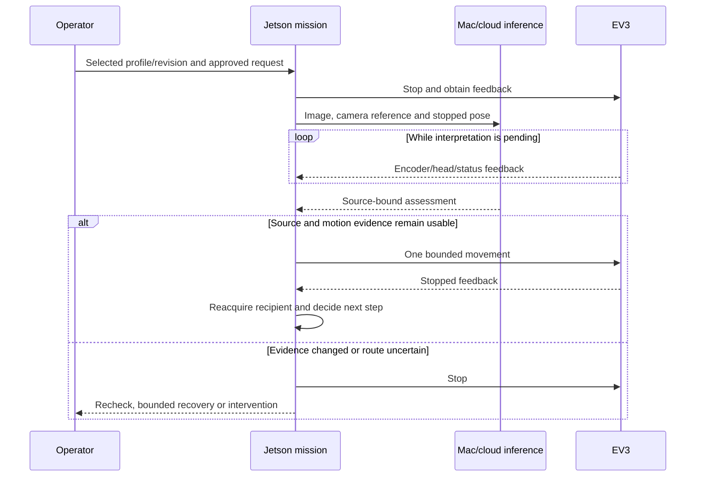

# Project framework: recipient-directed assistance

Following the Universal GitHub Project Framework, this guide documents Echora's problem, architecture, design decisions, implementation and evaluation. The hospital scenario defines the application; current demonstrations were conducted in a home room.

## Problem, existing approaches and scope

A request has an intended caregiver. Raising a general alert does not establish that this person received it, and a phone notification depends on device attention. Echora's computing problem is to bind a request to an enrolled identity, locate that person, preserve qualified continuity through occlusion and camera changes, and supervise a checked approach before speaking.

The system boundary includes enrollment, explicit recipient selection, camera perception, local mission authority, offboard visual interpretation, EV3 control and gated playback. Patient assignment, clinical triage, hospital directories and a recipient acknowledgement workflow are outside the current implementation. Mapping and multi-room navigation remain future work.

| Candidate baseline | Useful property | Question Echora explores | Comparison status |
|---|---|---|---|
| General callout | Can attract anyone nearby | Can the intended recipient be reached specifically? | Contextual baseline; no comparative response-time trial |
| Device notification | Addresses a selected device/account | Can attention be reached without device checking? | Contextual baseline; no comparative trial |
| Nearest-person robot | Simple recipient policy | Can identity selection survive a closer distractor? | Proposed controlled robotics baseline |
| Earlier appearance tracker | Face-anchored continuity through occlusion | Does revised partial-view matching improve continuity? | Offline comparison on one recording; identity accuracy unmeasured |
| Face-only tracking | Stronger identity evidence when visible | What does appearance add during face occlusion? | Proposed ablation; not evaluated |
| Fully onboard inference | Fewer remote dependencies | Can heavier interpretation be offloaded without transferring actuation authority? | Architectural alternative; no controlled whole-stack comparison |

These alternatives explain the decisions. They do not establish that Echora outperforms existing hospital alert systems.

## Goals and observable success criteria

| Goal | Observable pass condition | Evidence status |
|---|---|---|
| Reach the selected identity | Approach selected target while a closer non-target is present; retain identity/outcome records | Selection implemented; controlled distractor benchmark proposed |
| Coordinate one camera | Floor check uses its own referenced view; target reacquired before another approach | Implemented; selected room trials retained |
| Reject obsolete interpretation | Old image, changed profile, camera reference or motion state cannot authorize the tested action | Covered by selected offline regression checks |
| Supervise motion locally | Lost refresh/disconnect causes stop in tested service paths; cancellation prevents later queued motion | Software checks and historical hardware tests; current physical delay unmeasured |
| Deliver reviewed request | Matching recipient/message revision, validated standoff, stopped feedback and completed playback | Implemented gated path; owner reports complete find/approach/playback at home |
| Establish caregiver receipt | Intended person explicitly acknowledges the request | Owner reports human acknowledgement at home; no software acknowledgement feature |

Recognition, response-time and stopping-distance targets will be defined through a recorded evaluation protocol. The [evaluation guide](../evaluation/README.md) defines proposed trial records and baseline measurements.

## Architecture, concepts and decisions

The [README architecture](../README.md#architecture) shows deployment and authority boundaries. [Mission orchestration](../share/02_ARCHITECTURE_AND_MISSION.md) traces the actual entry points, and [distributed checks](../share/07_DISTRIBUTED_EXECUTION_AND_SAFETY.md) describe layer-specific freshness.

The underlying concepts are temporal evidence accumulation, profile/revision binding, state-machine control, shared-sensor scheduling, asynchronous request validation, serialized actuation, feedback supervision and bounded recovery. Fast inference is only one part of the mission's timing.

The [runtime supervision and recovery guide](RUNTIME_SUPERVISION_AND_RECOVERY.md) makes this coordination inspectable through failure triggers, fallback actions, retry limits, stopping conditions and source/test references. It also distinguishes runtime supervision, the verification/replay harness and physical cable support as separate engineering responsibilities.

| Consequential choice | Alternatives | Selected approach and trade-off | Record |
|---|---|---|---|
| Recipient evidence | Nearest person; face-only; appearance-only | Selected enrolled identity, repeated face observations and qualified appearance continuity; appearance can be ambiguous | [ADR 0001](adr/0001-recipient-identity-and-continuity.md) |
| Visual sensing | Fixed webcam; multiple cameras; depth/LiDAR | One motorized webcam, stop/inspect/move/reacquire; camera transitions create a person-view gap | [ADR 0002](adr/0002-shared-camera-and-segmented-motion.md) |
| Compute/control placement | Fully local inference; remote motion authority | Mac/cloud interpretation with Jetson authority and EV3 local timeout; networks add delay and failure modes | [ADR 0003](adr/0003-offboard-inference-local-authority.md) |

These retrospective records document the implemented design and its engineering trade-offs. The [ADR index](adr/README.md) explains their provenance.

## Implementation and evidence map

| Responsibility | Inspectable implementation | Relevant checks/evidence |
|---|---|---|
| Enrollment and face identity | [Family store](../robot/jetson/perception/family_store.py), [face matcher](../robot/jetson/perception/family_faces.py), [recognition configuration](../config/perception.yaml) | [Family memory tests](../tests/test_family_memory.py), [recorded stationary results](../share/09_EVALUATION_AND_RECORDED_RESULTS.md) |
| Appearance and motion-bound identity | [Continuity](../robot/jetson/perception/person_continuity.py), [wardrobe tracking](../robot/jetson/perception/wardrobe_tracking.py), [family observer](../robot/jetson/perception/family_observer.py) | [Partial-clothing tests](../tests/test_partial_clothing_tracking.py), [clothing guide](../share/05_CLOTHING_AND_SHARED_CAMERA.md) |
| Shared-camera mission | [Autonomous find](../robot/jetson/mission/autonomous_find.py), [camera lease](../robot/jetson/mission/camera_control_lease.py), [detour worker](../robot/jetson/navigation/closed_loop_detour.py) | [Route binding tests](../tests/test_detour_route_binding.py), [mission guide](../share/02_ARCHITECTURE_AND_MISSION.md) |
| Delayed route interpretation | [Mac route backend](../robot/mac/route_perception.py), [deterministic fusion](../robot/jetson/navigation/navigation_reasoning.py) | [Navigation reasoning tests](../tests/test_navigation_reasoning.py), [route limitations](../share/06_DEPTH_NAVIGATION_AND_APPROACH.md) |
| Actuation and cancellation | [Bridge worker](../robot/jetson/ev3_bridge/ros_node.py), [TCP client](../robot/jetson/ev3_bridge/ev3_client.py), [EV3 service](../robot/ev3/server/ev3_server.py) | [Worker tests](../tests/test_head_command_worker.py), [serialization tests](../tests/test_ev3_client_serialization.py), [EV3 tests](../tests/test_ev3_server.py) |
| Request approval and playback | [Speech delivery](../robot/jetson/perception/speech_delivery.py), [console](../robot/jetson/perception/enrollment_console.py), [Mac speech adapter](../robot/mac/voice_delivery.py) | [Delivery tests](../tests/test_speech_delivery.py), [API tests](../tests/test_robot_voice_delivery_api.py), [deployment guide](ROBOT_MESSAGE_DELIVERY.md) |

Model assets, private enrollment data and device environments are external requirements. Source availability is not a verified installation on every machine. See [reproduction requirements](../share/14_REPRODUCTION_REQUIREMENTS.md).

## Results, failures and validity

[Recorded results](../share/09_EVALUATION_AND_RECORDED_RESULTS.md) retain conditions and denominators, including the 220-to-289 continuity comparison on 297 evaluable frame/detection pairs. That comparison supports one recorded regression result, not cross-person recognition accuracy or physical arrival. On 2026-10-04 the owner reported a completed home caregiver scenario covering find, approach, playback and human acknowledgement. Quantitative records and a recording of that complete demonstration remain to be documented alongside the retained partial trials.

| Recorded issue | Mechanism/diagnosis | Mitigation and remaining question |
|---|---|---|
| USB camera disconnect during turn | Movement-sensitive lead/extender | Stop and bounded reconnect; permanent harness reliability still matters |
| Lower-view identity loss during approach | Shared camera cannot observe person and floor simultaneously | Stop/reacquire; test target motion during the blind interval |
| Requested 5 cm, encoder-estimated travel 6.77 cm | Feedback, stopping tolerance and tracked motion | Short moves plus feedback; independently measure ground travel/stopping gap |
| Monocular distance disagreed with physical checks | Camera geometry, depth model/domain and origin assumptions | Separate measured from approximate range; approximate arrival cannot authorize speech |
| Camera head failed during retained recording | Operator reported depleted battery | Bounded faults/hold behavior; test battery-dependent motion and stop outcomes |

**Internal validity:** threshold/configuration changes and selection of successful scenes can affect comparisons. Use the same recording/configuration or fixed scenario for each baseline. **External validity:** household subjects, room geometry and correlated frames do not establish hospital-uniform, crowded-room or clinical performance. **Measurement validity:** playback completion is not receipt; encoder travel is not independent ground distance; a floor label is not full clearance. **Reproducibility:** native dependencies, TensorRT engines, private profiles, calibration and cloud/model revisions are not fully pinned in one environment.

The [claim matrix](../share/12_CLAIM_EVIDENCE_MATRIX.md) and [limitations](../share/13_COVERAGE_LIMITATIONS_AND_OPEN_QUESTIONS.md) distinguish implemented code, executed checks, recorded trials, owner-reported outcomes and proposed validation.

## Ownership, learning and next questions

The project owner designed, implemented, integrated and tested the system, including hardware integration and evaluation. Development notes record coding-agent assistance, and pretrained models and frameworks are attributed separately. See [ownership and data handling](../share/11_CONTRIBUTIONS_OWNERSHIP_AND_DATA.md).

The evidence changes three useful assumptions: a fast detector does not make a fast mission; a better stationary appearance tracker does not prove continuity across camera transitions; and source-bound offboard advice still needs current actuator/scene checks before action. These observations explain why timing, identity and motion coordination belong in the contribution alongside the perception models.

Next questions are whether similar uniforms cause wrong-recipient continuity, how far a target can move during floor inspection, whether measured range predicts an independently observed stopping gap, and how cancellation/connection loss behave at low battery. Retain the complete home demo with exact recipient, request, interventions, playback and acknowledgement outcomes before quantifying delivery reliability. Measure caregiver attention or response-time benefit separately if a hospital evaluation is later undertaken.

## Framework readiness

The repository includes a problem-led README, architecture and interaction diagrams, design decisions, implementation and test references, and an offline verification command. Existing results and failure analysis remain in the technical dossier. Remaining work includes quantitative end-to-end evaluation, controlled recipient comparisons, a public demonstration and a project-wide redistribution license.
