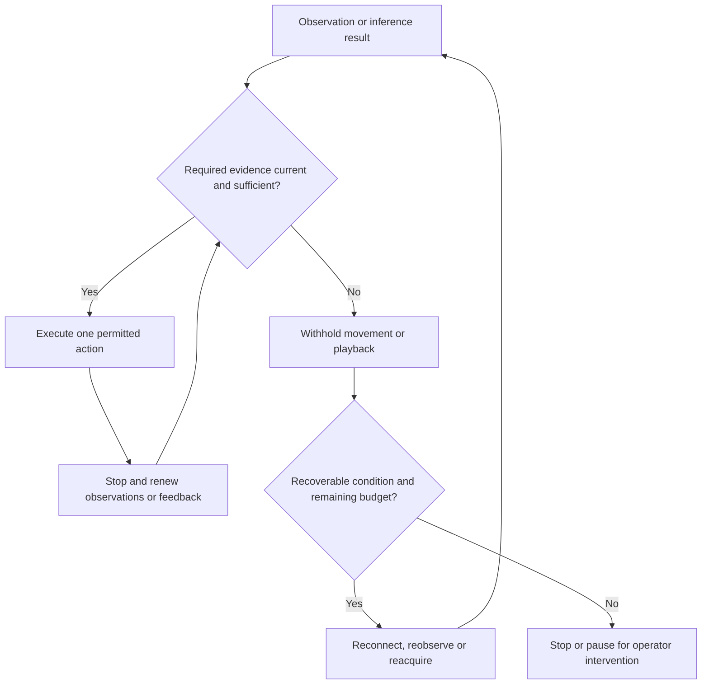

# Runtime supervision, fallback policies and verification

The project's systems-engineering contribution includes the coordination code around its perception models: evidence validation, camera scheduling, serialized actuation, feedback supervision and bounded recovery. This guide maps those mechanisms to implementation and verification. The runtime harness is distributed across existing services rather than implemented as a single component.

| Responsibility | Purpose | Repository entry points |
|---|---|---|
| Runtime supervision harness | Decide whether an observation can support an action; supervise execution, cancellation and recovery | [Mission](../robot/jetson/mission/autonomous_find.py), [bridge worker](../robot/jetson/ev3_bridge/ros_node.py), [EV3 service](../robot/ev3/server/ev3_server.py) |
| Verification and replay harness | Exercise selected policies with controlled inputs and inspect recorded behavior | [Offline checks](../scripts/diagnostics/reproduce_checks.py), [recorder](../scripts/diagnostics/record_mission.py), [replay](../scripts/diagnostics/replay_mission.py) |
| Physical cable and camera harness | Manage tether strain, rotation limits and camera loading | [Cable and camera support acceptance](CABLE_AND_CAMERA_SUPPORT.md) |

## Action supervision

The Jetson owns mission decisions while the Mac and cloud return interpretations. Each consumer checks the bindings relevant to its action: these can include source image/hash, request, selected identity/profile revision, track, motion epoch, camera reference and stopped pose. A result that fails the applicable checks is discarded or cannot authorize the next action. Freshness and binding requirements differ across stages; there is no single universal expiry policy.

Camera movement uses a serialized worker so feedback can continue while a head request runs. Cancellation and replacement are checked under the TCP client's command lock before subsequent actuator calls. Track movement is segmented: stop, inspect, decide, execute one bounded segment, stop and reacquire. The EV3 separately supervises drive-command refreshes and head-motion progress.

This diagram summarizes the policy for an action requiring current evidence; individual entry points implement their own states and budgets.



## Fallback and recovery policies

Limits below describe current defaults or specific paths. Deployment arguments, saved camera ranges and entry points can change them.

| Trigger | Response | Bound or stopping condition | Implementation |
|---|---|---|---|
| Missing/stale person detections, unusable crops or no face in person crops | Run YuNet on the full fresh frame | Separate rate cap, currently 3 Hz; face detection still requires enrolled-identity matching | [Face detector](../robot/jetson/perception/face_detector.py), [frame/detection association](../robot/jetson/perception/face_sync.py) |
| Cloud camera-framing advice missing, invalid or delayed | Continue local body/face framing rules; visible face evidence takes precedence | Detector-only path allows three upward probes before restoring a useful view; cloud-guided investigation has adjustment/check limits, saved-range limits and a 60-second investigation-loop budget with separately bounded waits, moves and restoration | [Search-view policy](../robot/jetson/mission/search_view_policy.py), [bounded scan](../robot/jetson/mission/bounded_target_scan.py) |
| Confirmed person's face temporarily hidden | Use face-anchored appearance memory and partial-clothing continuity | Ambiguous matches cannot establish a unique identity; clothing is distinct from a new face observation. Current policy can use clothing for acquisition, approach, arrival and delivery | [Wardrobe tracking](../robot/jetson/perception/wardrobe_tracking.py), [family observer](../robot/jetson/perception/family_observer.py) |
| Returned interpretation no longer matches its source or robot state | Reject obsolete identity, range or route evidence and obtain new observations | Stage-specific age and source/reference checks; route binding rejects excessive translation or rotation from its checked pose | [Family observer](../robot/jetson/perception/family_observer.py), [detour worker](../robot/jetson/navigation/closed_loop_detour.py) |
| Camera stops delivering usable frames | Reopen the capture or restart the managed publisher; require new frames before resuming the scan | Capture reopens after 15 consecutive invalid reads, paced at two seconds; publication watchdog uses 12 seconds. Mission recovery checks fresh frames and unchanged head/motor references | [Frame health](../robot/jetson/camera/frame_health.py), [camera node](../robot/jetson/camera/camera_node.py), [recovery](../robot/jetson/camera/camera_recovery.py), [bounded scan](../robot/jetson/mission/bounded_target_scan.py) |
| Blocked route, lost target or transient feedback failure | Classify the interruption, stop and retry the relevant observation/reacquisition step | Default limits: three recoveries, one candidate retry, two reacquisition retries, two search moves and eight approach steps. Partial movement requires reacquisition; changed references, unknown cable heading, failed stops and direction/boundary faults require intervention | [Recovery policy](../robot/jetson/mission/recovery_policy.py), [autonomous find](../robot/jetson/mission/autonomous_find.py) |
| Head motor stalls or request is cancelled | Retry the same absolute target within the existing motion bounds; prevent cancelled work from issuing later commands | EV3 default: one retry after one second without progress, retaining the original eight-second movement deadline. Bridge chunk deadlines and step bounds also apply; exhausted brick retries are terminal | [EV3 service](../robot/ev3/server/ev3_server.py), [camera head](../robot/jetson/ev3_bridge/camera_head.py), [command worker](../robot/jetson/ev3_bridge/ros_node.py) |
| Accepted drive-command refreshes cease or client disconnects | EV3 stops the motors without waiting for a network stop instruction | Default refresh timeout: 500 ms. Status polling does not renew it. The watchdog shares the EV3 service thread and depends on that thread continuing to run | [EV3 service](../robot/ev3/server/ev3_server.py) |
| Validated recipient range unavailable | Optional approximate mode uses camera geometry and short checked moves | Estimate remains labelled unvalidated and requires consistent samples. Playback requires a validated range interval entirely within 0.5–0.7 m, checked feet, current unique recipient evidence, and stopped track/head feedback | [Family observer](../robot/jetson/perception/family_observer.py), [approach policy](../robot/jetson/mission/person_approach.py), [speech gate](../robot/jetson/perception/speech_delivery.py) |
| TensorRT detector unavailable | Automatic backend selection can report a CPU fallback | The deployed configuration explicitly selects TensorRT; that path fails on an unavailable engine instead of silently switching | [Inference backend](../robot/jetson/perception/inference.py), [configuration](../config/perception.yaml) |

Fallback authority is specific to the failed stage. Local camera probes can continue person search when framing advice is unavailable. They do not authorize navigation without route evidence. Missing or uncertain floor/corridor evidence withholds movement; local visual vetoes and bounded recovery still apply.

The mission recovery classifier currently reads child outcomes and error text. Budgets are per operation or mission path, rather than one deadline covering the entire system. The camera publication watchdog detects missing publication; frozen pixels with newly generated timestamps can evade that check. These implementation details matter when extending the fault vocabulary or adding another entry point.

## Verification harness and coverage

From the repository root with Python 3.11 or later:

```sh
python3 scripts/diagnostics/reproduce_checks.py
```

The selected suite passed **138 checks across 11 modules** on 4 October 2026, including an export containing only staged repository files. It uses fake motors, sockets and clocks, generated observations and a synthetic cloud-view fixture. An audit hook rejects live network connections, subprocess launches and device access in these selected checks; missing imports, skips and expected failures count as failures. [Evaluation and reproduction](../evaluation/README.md) records the run and interpretation.

The table separates coverage in that reproducible suite from additional tests present in the repository. The latter are source references, not a claim that every test has been freshly executed in the minimal environment.

| Behavior | Test entry points | Included in selected suite? |
|---|---|---|
| Source-bound route/view checks | [Detour route binding](../tests/test_detour_route_binding.py), [cloud-view calibration](../tests/test_cloud_view_calibration.py) | Yes |
| Appearance continuity | [Person continuity](../tests/test_person_continuity.py), [family memory](../tests/test_family_memory.py), [partial clothing](../tests/test_partial_clothing_tracking.py) | Person continuity only |
| Cancellation, serialization and EV3 timeout/stall handling | [Head worker](../tests/test_head_command_worker.py), [TCP serialization](../tests/test_ev3_client_serialization.py), [EV3 service](../tests/test_ev3_server.py) | Yes |
| Local framing when cloud advice is unavailable | [Search-view policy](../tests/test_search_view_policy.py) | Additional tests |
| Camera restart and mission recovery | [Frame health](../tests/test_frame_health.py), [camera-drop recovery](../tests/test_camera_drop_recovery.py), [Phase 6 recovery](../tests/test_phase6_recovery.py), [autonomous find](../tests/test_autonomous_find.py) | Additional tests |
| Approximate range and gated delivery | [Approximate person range](../tests/test_approximate_person_range.py), [speech delivery](../tests/test_speech_delivery.py) | Additional tests |
| Backend availability/fallback | [Inference backends](../tests/test_inference_backends.py) | Additional tests |

The [mission recorder](../scripts/diagnostics/record_mission.py) subscribes to images, mission state and feedback without issuing motor or cloud commands. Duration, frame rate and storage limits bound capture. The [replay tool](../scripts/diagnostics/replay_mission.py) supports offline analysis or an isolated localhost ROS domain; it does not republish recorded drive/head commands. Replay retains the recorded trajectory, so a changed policy cannot produce the camera views and encoder feedback of a different physical path.

The [integrated simulator](../scripts/diagnostics/simulate_integrated_mission.py) supplies synthetic images/telemetry and mocked HTTP responses in an isolated ROS domain while exercising mission subprocesses. It has no contact physics or real perception models. Historical outcome assertions require reconciliation with current paused-mission behavior before a fresh simulator pass is claimed.

## Physical harness and validation boundaries

The [cable and camera support guide](CABLE_AND_CAMERA_SUPPORT.md) specifies central strain relief, slack outside the tracks and camera arm, a marked neutral heading, camera counterbalance and loaded-motion acceptance. Software turn limits depend on the configured run; they do not verify physical cable clearance. Retained notes record successful bounded scans alongside USB-lead disconnections, so physical harness reliability remains an unattended-operation gate.

Selected recovery paths have code, offline checks and historical physical observations. The owner also reports a complete home caregiver demonstration. These establish different evidence: the demonstration does not independently validate every fault path, and software tests do not measure physical stopping delay. Similar-uniform identity errors, obstacle coverage and current fault-stop timing remain evaluation work. See [distributed execution and fault limits](../share/07_DISTRIBUTED_EXECUTION_AND_SAFETY.md) and the [claim–evidence matrix](../share/12_CLAIM_EVIDENCE_MATRIX.md).
