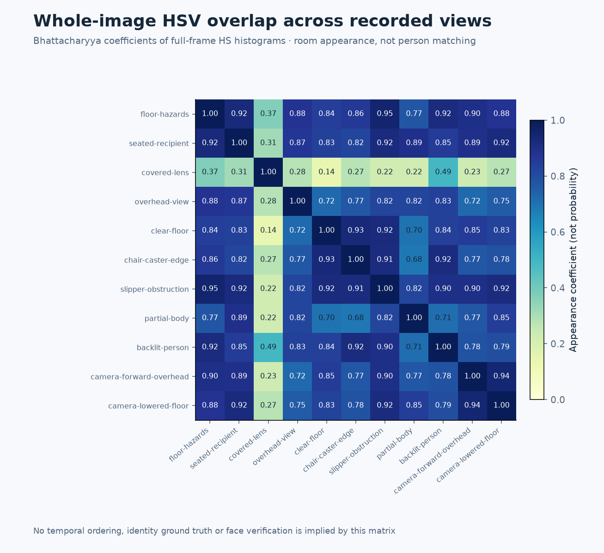
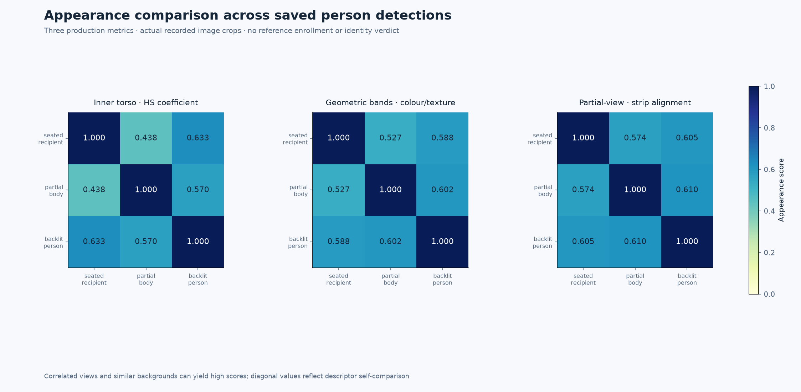
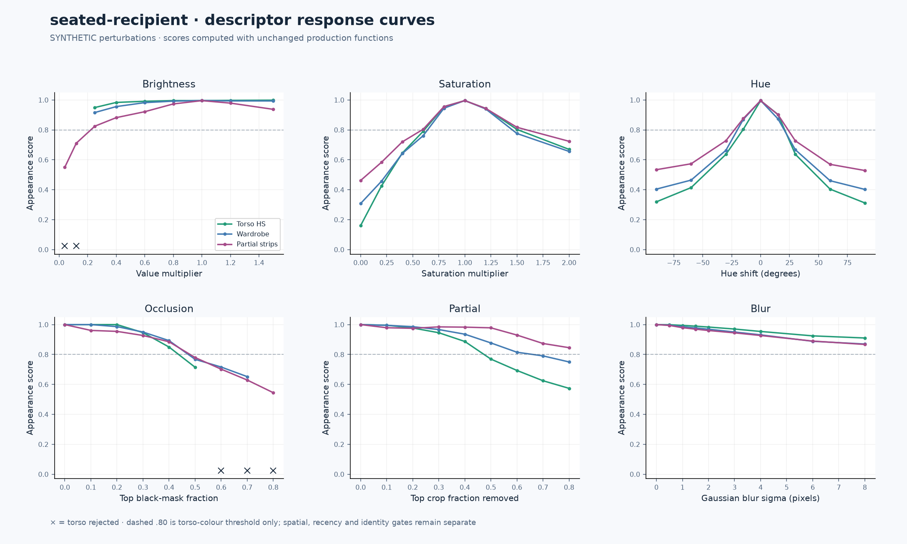
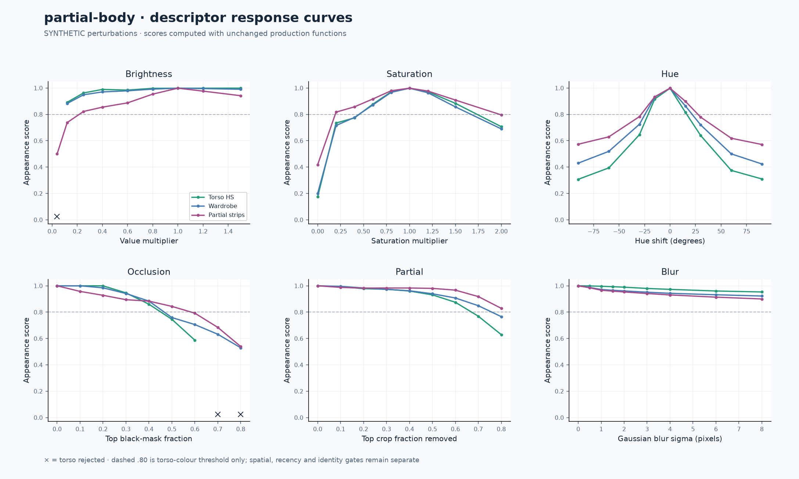
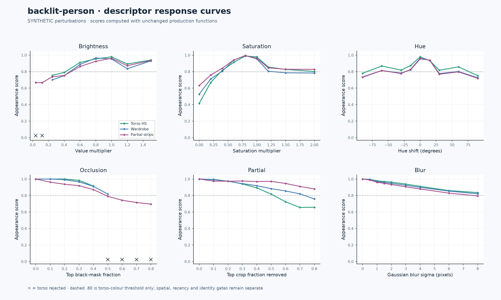
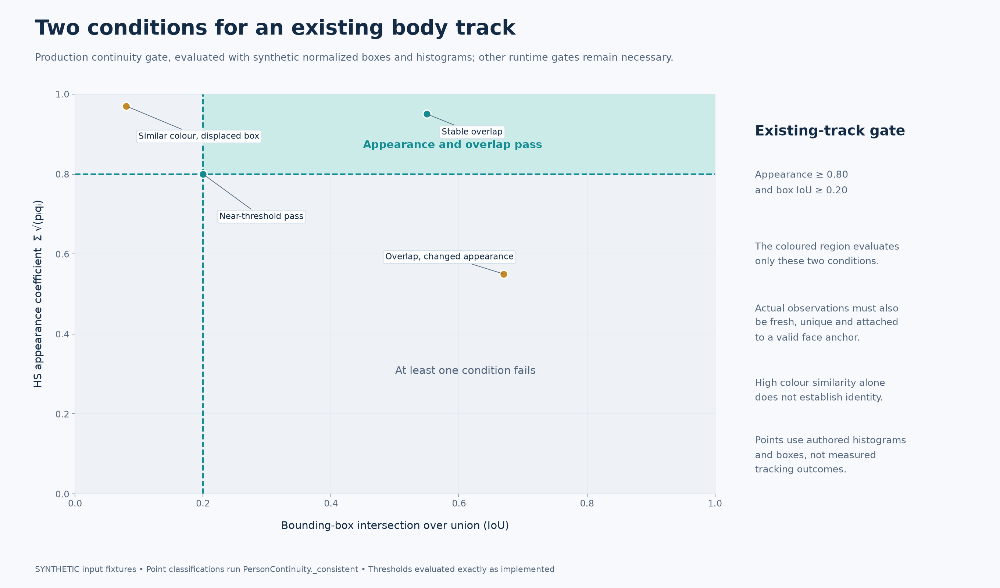
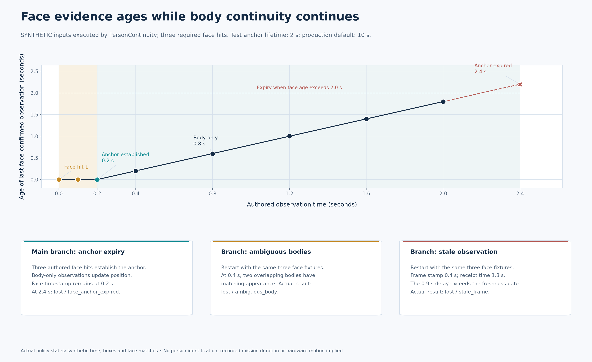
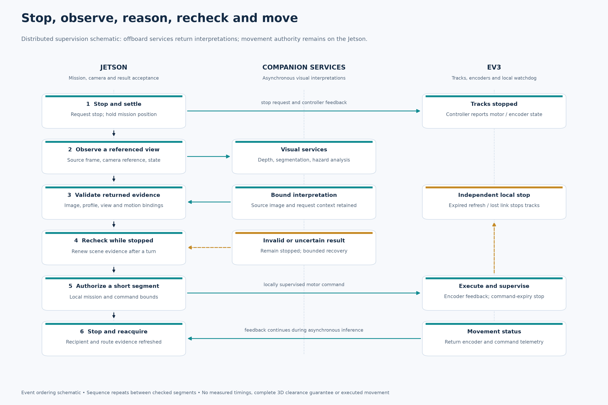

# Appearance diagnostics from recorded test captures

HSV distributions, production clothing descriptors and controlled perturbation experiments expose how appearance cues support continuity and where they become unreliable. Original captures and synthetic variations retain separate provenance.


*Whole-image Hue–Saturation distributions include background and retained source overlays. Hue is less useful in dark or low-saturation regions.*

## Recorded-input diagnostics

| Test view | HSV analysis |
|---|---|
| Cable, footwear and furniture | [Channel distributions and joint HS](figures/hsv-floor-hazards.png) |
| Seated person with visible face | [Channel distributions and joint HS](figures/hsv-seated-recipient.png) |
| Covered or dark capture | [Channel distributions and joint HS](figures/hsv-covered-lens.png) |
| Overhead view | [Channel distributions and joint HS](figures/hsv-overhead-view.png) |
| Floor-dominant view | [Channel distributions and joint HS](figures/hsv-clear-floor.png) |
| Chair caster at the frame edge | [Channel distributions and joint HS](figures/hsv-chair-caster-edge.png) |
| Slipper in the floor view | [Channel distributions and joint HS](figures/hsv-slipper-obstruction.png) |
| Partial body; face outside the frame | [Channel distributions and joint HS](figures/hsv-partial-body.png) |
| Backlit person | [Channel distributions and joint HS](figures/hsv-backlit-person.png) |
| Forward-labelled view of the ceiling | [Channel distributions and joint HS](figures/hsv-camera-forward-overhead.png) |
| Lowered camera view of the floor | [Channel distributions and joint HS](figures/hsv-camera-lowered-floor.png) |



*Full-frame coefficients compare scene colour distributions, including background. They are not person-matching probabilities or a temporal track.*

## Person appearance descriptors

Saved person boxes define the ROIs; no person detection is invented for views where the detector returned none. The torso histogram, geometric clothing bands and ordered-strip signatures call the production functions directly. Band names indicate proportional positions, not anatomical segmentation.



*Appearance scores are not identity probabilities. These saved crops have no new facial confirmation, enrolled reference or time-synchronized track sequence.*

| Saved detection | Torso HSV | Clothing bands | Partial strips |
|---|---|---|---|
| seated-recipient | [ROI and descriptor](figures/torso-seated-recipient.png) | [Colour and texture](figures/wardrobe-seated-recipient.png) | [Ordered signatures](figures/strips-seated-recipient.png) |
| partial-body | [ROI and descriptor](figures/torso-partial-body.png) | [Colour and texture](figures/wardrobe-partial-body.png) | [Ordered signatures](figures/strips-partial-body.png) |
| backlit-person | [ROI and descriptor](figures/torso-backlit-person.png) | [Colour and texture](figures/wardrobe-backlit-person.png) | [Ordered signatures](figures/strips-backlit-person.png) |

## Controlled perturbation experiments

**Synthetic inputs.** Deterministic Value, saturation, hue, occlusion, partial-crop and blur transforms are applied to saved detection crops. Detector boxes are fixed; no face, VLM or identity model is rerun. The report records every transform parameter, pixel hash, resulting score and descriptor rejection. No transform is assigned the historical capture time.

### seated-recipient



[Brightness variants](figures/synthetic-brightness-seated-recipient.png) · [Saturation variants](figures/synthetic-saturation-seated-recipient.png) · [Hue variants](figures/synthetic-hue-seated-recipient.png) · [Occlusion variants](figures/synthetic-occlusion-seated-recipient.png) · [Partial variants](figures/synthetic-partial-seated-recipient.png) · [Blur variants](figures/synthetic-blur-seated-recipient.png)

### partial-body



[Brightness variants](figures/synthetic-brightness-partial-body.png) · [Saturation variants](figures/synthetic-saturation-partial-body.png) · [Hue variants](figures/synthetic-hue-partial-body.png) · [Occlusion variants](figures/synthetic-occlusion-partial-body.png) · [Partial variants](figures/synthetic-partial-partial-body.png) · [Blur variants](figures/synthetic-blur-partial-body.png)

### backlit-person



[Brightness variants](figures/synthetic-brightness-backlit-person.png) · [Saturation variants](figures/synthetic-saturation-backlit-person.png) · [Hue variants](figures/synthetic-hue-backlit-person.png) · [Occlusion variants](figures/synthetic-occlusion-backlit-person.png) · [Partial variants](figures/synthetic-partial-backlit-person.png) · [Blur variants](figures/synthetic-blur-backlit-person.png)

## Policy and supervision diagrams

The diagrams describe implemented rules. The continuity timeline uses authored face/geometry observations through the production class; it is not a reconstruction of a physical mission.






*The timeline uses a two-second face-anchor lifetime to make expiry visible; the production default is ten seconds. Appearance observations do not renew the original face confirmation.*



## Provenance and reproduction

[Descriptor values, source hashes, ROI geometry and transform results](data/appearance-results.json) and [synthetic policy states and diagram provenance](data/policy-diagrams.json) accompany the images. Current analysis timestamps identify computation; source provenance identifies the retained captures. The generators accept arbitrary image directories or manifests and optional saved detection reports. No network, robot or model service is started.

```sh
python local_diagnostics/tools/analyze_appearance.py \
  --manifest evaluation/visual-scenarios/manifest.json \
  --detections-json evaluation/visual-scenarios/local-results.json \
  --output evaluation/appearance-diagnostics
python local_diagnostics/tools/draw_policy_diagrams.py --output-dir evaluation/appearance-diagnostics
```

For another dataset, replace `--manifest` with `--input-dir /path/to/recorded/images`. Without a detection report, the tool renders only whole-image diagnostics; it does not infer or fabricate person boxes. Use a Python environment containing OpenCV, NumPy and Matplotlib. Generation scripts live under the Git-ignored `local_diagnostics/tools/` directory. Figures, numerical reports and this gallery remain normal repository files for review.
