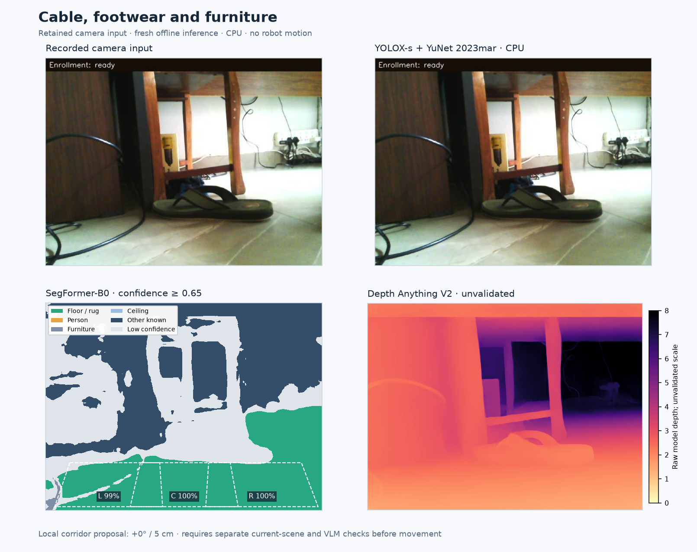
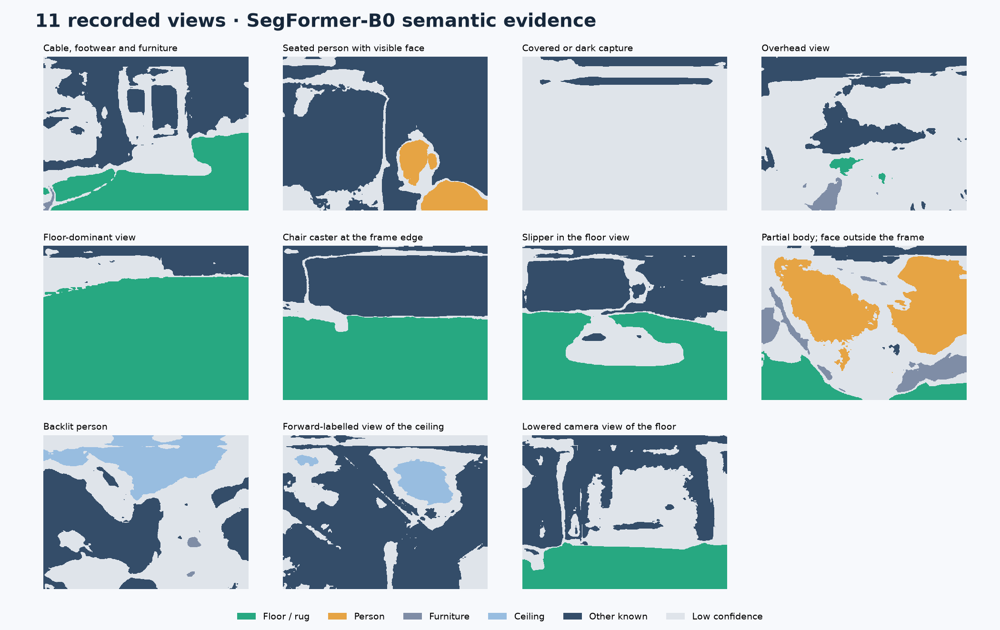
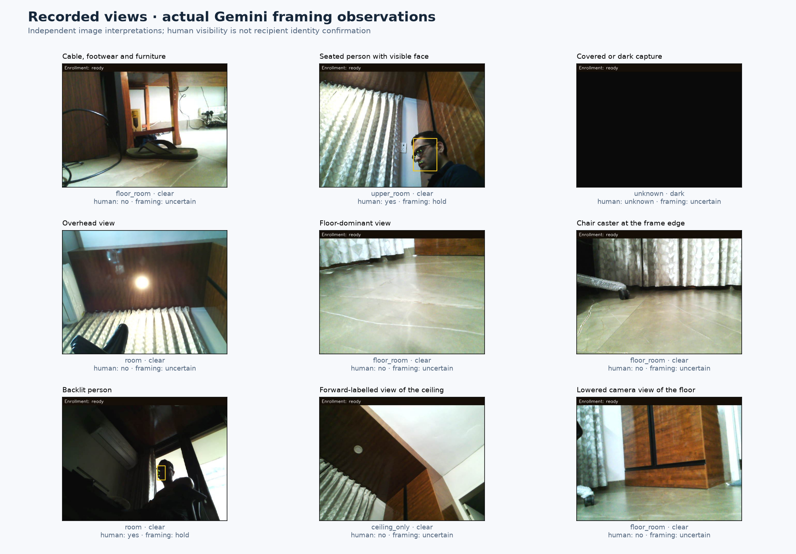

# Visual scenario evaluation

Eleven retained home-room camera images exercise the robot's person observation, floor inspection, camera framing and appearance-description pipeline. Fresh model inference was performed on **4 October 2026**; the plots below render the saved numerical outputs and structured responses.

| Evidence | Completed coverage | Published record |
|---|---|---|
| Original camera inputs | 11 selected views: visible face, partial body, backlighting, cable, footwear, chair caster, dark capture and camera-view mismatch | [Image manifest and provenance](manifest.json) |
| Local vision inference | YOLOX-s, YuNet, SegFormer-B0 and Depth Anything V2 on all 11 images | [Detections, class fractions, settings and hashes](local-results.json) |
| Gemini inference | 10 requests: 3 three-image framing batches, 4 route reviews, 2 paired-view interpretations and 1 clothing description; 16 structured observations | [Actual responses and request metadata](vlm-results.json) |
| Conditional policy checks | 20 authored scenarios run through production policy functions | [Inputs and expectations](scenario_checks.json), [20/20 results](policy-results.json) |
| Floor-label regression checks | 5 tests for valid support surfaces and invalid/duplicate/unknown labels | [Tests](../../tests/test_floor_label_mapping.py) |

The images are real retained captures; the policy fixtures are synthetic. This is a qualitative diagnostic set from one home, selected to expose distinct conditions. It has no independent pixel, hazard or identity ground truth and does not estimate model accuracy, physical clearance or caregiver-delivery success. No robot motion, new facial identity verification, speech playback or hospital trial was performed for this evaluation.

## Local model outputs



*Each diagnostic panel shows the retained input, fresh person/face detections, confidence-filtered semantic groups with the production corridor polygons, and raw depth-model output. The route proposal is a local image heuristic; further scene, cloud and stopped-state checks are required before movement.*

YOLOX-s uses the production preprocessing, decoding and non-maximum suppression through OpenCV DNN on CPU. YuNet uses OpenCV's full-frame `FaceDetectorYN` diagnostic path. These runs differ from the Jetson's TensorRT FP16 deployment and person-crop face pipeline. SegFormer and depth use the Mac production backends with cached checkpoints on CPU, float32.

Fresh boxes are **cyan for people** and **magenta for faces/landmarks**. Original enrollment banners, yellow face boxes and green landmarks remain in the input images; those historical overlays are distinct from the fresh detections and can influence inference. A face box establishes detection, not enrolled-recipient identity.

The segmentation display groups ADE20K classes into floor/rug, person, furniture, ceiling, other known and low confidence. The confidence threshold is **0.65**. All argmax labels and maximum probabilities are retained in the numerical arrays; the grouped display is for inspection. Corridor percentages denote floor among known sampled pixels, rather than the fraction of all corridor pixels proved traversable.



*The selected views expose both usable floor regions and difficult inputs. For example, the overhead image contains a small predicted floor region despite showing no usable floor. These predictions remain visible in the report.*

Depth uses **Depth Anything V2 Metric Indoor Small**. The gallery applies no camera geometry or range calibration, and the outputs have no independently measured distance reference. Its fixed colour scale clips the display at 8; the saved float32 depth arrays retain the full model output. These plots cannot establish stopping distance.

## Actual Gemini responses

The 10 published requests completed using **`gemini-3.5-flash-lite`**. The runner uses the existing framing, navigation, occlusion and wardrobe adapters. Responses are advisory and contain no motor commands. The report records model ID, image hashes, prompt/schema-template hashes, evaluation context, elapsed time and sanitized token usage; its request signatures describe the evaluated inputs rather than a complete serialized provider request.

Requests containing an image withdrawn from the gallery were removed in full. The remaining responses preserve their original image order, input bindings and request metadata; no response was reassigned to a different image set. The slipper and partial-body inputs retain local-model outputs but have no published framing response.



*The published framing observations distinguish dark captures, floor views and visible people. The forward-labelled ceiling view was classified as `ceiling_only`. Human visibility does not confirm the selected recipient.*

For route review, Gemini receives the original image, the exact normalized candidate polygons and the local evidence. The following plot places the returned classifications beside those polygons:


*Gemini flagged a cable in the left candidate and footwear in the centre candidate, with a rightward preference. The saved local segmentation had proposed the centre. The conditional fusion preview demonstrates how the returned vetoes affect the production rule; it reuses one saved frame as both local inputs, has no fresh scene recheck and authorizes no movement.*

| Route image | Actual returned hazard classes, left / centre / right | Inspect the response |
|---|---|---|
| Cable, footwear and furniture | `thin_object` / `solid_object` / `none` | [Polygon and response plot](figures/vlm-route-floor-hazards.png) |
| Floor-dominant view | `none` / `none` / `none` | [Polygon and response plot](figures/vlm-route-clear-floor.png) |
| Chair caster at frame edge | `solid_object` / `none` / `none` | [Polygon and response plot](figures/vlm-route-chair-caster-edge.png) |
| Slipper in floor view | `none` / `thin_object` / `none` | [Polygon and response plot](figures/vlm-route-slipper-obstruction.png) |

These are the model's classifications, including imperfect categories and spatial judgments. The slipper was classified as `thin_object`. In the cable/footwear example, the footwear is largely above the trimmed near-floor polygon, so readers should inspect the claimed overlap. A hazard-free response is not measured clearance. [Conditional fusion outputs](fusion-previews.json) explicitly record `movement_authorized: false`.

The paired-view requests returned `partial_person` for the seated-face/partial-body pair and `camera_changed` for the ceiling/floor pair. Their ordering and camera-change bindings are authored evaluation fixtures, not proof of a synchronized physical transition or identity continuity.

The retained wardrobe request used **describe-only** mode with no enrolled clothing references. It described blue upper/lower clothing in the partial-body image and returned `uncertain` with an empty reference ID. It also associated an unworn background sandal with the subject's footwear even though the feet are outside the frame, exposing an appearance-association error. This output demonstrates descriptor generation, not clothing-based recipient matching.

## Inspect every retained input

Each linked diagnostic contains the same four model panels. Detection counts are outputs from this run, not accuracy scores.

| View and original input | Fresh people / faces | Diagnostic |
|---|:---:|---|
| [Cable, footwear and furniture](../../assets/test-samples/floor-observation-20260906.jpg) | 0 / 0 | [Models](figures/floor-hazards.png) |
| [Seated person with visible face](../../assets/test-samples/seated-recipient-20260905.jpg) | 1 / 1 | [Models](figures/seated-recipient.png) |
| [Covered or dark capture](../../assets/visual-scenarios/inputs/covered-lens.jpg) | 0 / 0 | [Models](figures/covered-lens.png) |
| [Overhead view](../../assets/visual-scenarios/inputs/overhead-view.jpg) | 0 / 0 | [Models](figures/overhead-view.png) |
| [Floor-dominant view](../../assets/visual-scenarios/inputs/clear-floor.jpg) | 0 / 0 | [Models](figures/clear-floor.png) |
| [Chair caster at frame edge](../../assets/visual-scenarios/inputs/chair-caster-edge.jpg) | 0 / 0 | [Models](figures/chair-caster-edge.png) |
| [Slipper in floor view](../../assets/visual-scenarios/inputs/slipper-obstruction.jpg) | 0 / 0 | [Models](figures/slipper-obstruction.png) |
| [Partial body; face outside frame](../../assets/visual-scenarios/inputs/partial-body.jpg) | 1 / 0 | [Models](figures/partial-body.png) |
| [Backlit person](../../assets/visual-scenarios/inputs/backlit-person.jpg) | 1 / 0 | [Models](figures/backlit-person.png) |
| [Forward-labelled ceiling view](../../assets/visual-scenarios/inputs/camera-forward-overhead.jpg) | 0 / 0 | [Models](figures/camera-forward-overhead.png) |
| [Lowered floor view](../../assets/visual-scenarios/inputs/camera-lowered-floor.jpg) | 0 / 0 | [Models](figures/camera-lowered-floor.png) |

Two useful disagreements remain in the saved outputs: Gemini described the backlit face as visible although fresh YuNet returned no face, and it labelled the overhead reference `room` rather than `ceiling_only`. These cases support checking model interpretations against current geometry and visibility rather than treating a fluent description as ground truth.

## Policy harness and fallback coverage

The [scenario checker](../../scripts/diagnostics/check_visual_scenarios.py) verifies the retained image bytes, then feeds **authored observations** into the actual deterministic policy functions. It does not interpret those pixels or derive its fixture values from the model reports. Positive controls and failure injections make the expected branch explicit.

| Policy boundary | Authored cases |
|---|---|
| Route fusion and result binding | Positive corridor, thin-object veto, all hazards, uncertain floor, changed second local input, dark advice, invalid schema, mismatched image binding and unstable-scene flag |
| Camera framing | Cloud-unavailable local probe, fresh face overriding cloud advice and upward-probe budget |
| Occlusion recovery | View restoration after tilt, expired person context and changed camera-head reference |
| Approach and delivery | Approximate short step, hidden-feet inspection, wrong-track range rejection, validated delivery positive control and approximate arrival withholding playback |

The [20 case definitions](scenario_checks.json) and [recorded results](policy-results.json) retain complete inputs, expected subsets and actual outputs. The separate [138-test regression suite](../README.md#reproduce-automated-checks) covers identity continuity, source/state binding, command cancellation and the EV3 watchdog with fake actuators and clocks.

| Project feature | Evidence added here | Remaining boundary |
|---|---|---|
| Person and face detection | Fresh YOLOX-s/YuNet detections on 11 images | No new InsightFace embeddings or enrolled-recipient recognition run |
| Floor and depth inference | Fresh SegFormer/depth outputs and saved arrays | No calibrated footprint, measured range or obstacle ground truth |
| Cloud scene understanding | Actual framing, route, paired-view and wardrobe responses | No identity conclusion from scene/clothing descriptions |
| Recovery and action gating | Conditional policy cases plus existing regression tests | No newly injected physical fault or measured stop delay |
| Caregiver request delivery | Existing implementation and owner-reported completed home scenario | No new speech/acknowledgement trial in this image evaluation |

The evaluation also resolved a documented configuration defect: ADE20K class **21 is water**, but the old default included it as floor. The source now defaults to **3 = floor, 28 = rug** and validates support-surface names when loading the model. [Five regression tests](../../tests/test_floor_label_mapping.py) reject water, unknown labels and invalid selections. The correction is included in this source revision and the offline outputs; deployment to the robot was not performed.

## Reproduce the outputs

From the repository root, with Python 3.11 or later, run the hardware-free checks:

```sh
python3 scripts/diagnostics/reproduce_checks.py
python3 scripts/diagnostics/check_visual_scenarios.py
python3 -m unittest tests.test_floor_label_mapping
```

Recorded results on macOS/Python 3.14.7: **138 regression tests, 20 scenario checks and 5 floor-label tests passed**. CI runs these three commands. No hosted CI result is claimed by this local record.

For inference, provision the separately distributed checkpoints matching [the recorded revisions and SHA-256 values](local-results.json). Official sources are [YOLOX release 0.1.1rc0](https://github.com/Megvii-BaseDetection/YOLOX/releases/tag/0.1.1rc0), [OpenCV YuNet 2023mar](https://github.com/opencv/opencv_zoo/tree/main/models/face_detection_yunet), [NVIDIA SegFormer-B0](https://huggingface.co/nvidia/segformer-b0-finetuned-ade-512-512) and [Depth Anything V2 Metric Indoor Small](https://huggingface.co/depth-anything/Depth-Anything-V2-Metric-Indoor-Small-hf). Weights are not committed. The builder verifies local weight hashes, records configuration hashes and disables automatic model downloads. Use the recorded configuration hashes to check your snapshot before rerunning.

The recorded inference environment was macOS arm64, Python 3.12.13, PyTorch 2.14.0, Transformers 5.16.1, NumPy 2.5.2, OpenCV 5.0.0, Pillow 12.3.0 and Matplotlib 3.11.1. The CPU path uses seed 0 and four Torch/OpenCV threads. Single-image timings in the JSON are diagnostic timings without a formal warm-up/repetition protocol; they are not deployment benchmarks.

Set the four variables below to your local checkpoint locations, then run:

```sh
python scripts/diagnostics/build_visual_scenarios.py \
  --segformer-snapshot "$SEGFORMER_SNAPSHOT" \
  --depth-snapshot "$DEPTH_SNAPSHOT" \
  --yolox-onnx "$YOLOX_ONNX" \
  --yunet-onnx "$YUNET_ONNX"
```

This overwrites local results, arrays and local-model figures under `evaluation/visual-scenarios/`. It starts no robot services. To regenerate only the plots from the saved arrays:

```sh
python scripts/diagnostics/build_visual_scenarios.py --render-only
python scripts/diagnostics/render_visual_vlm.py
```

The [`.npz` arrays](arrays/) contain `labels` (uint8), `confidence` (float16), `semantic_groups` (uint8) and `depth` (float32). Array and local-figure hashes are recorded in `local-results.json`; inference source hashes identify the executed code alongside the base Git revision.

Inspect the bounded cloud plan without credentials or network, then explicitly opt in to sending the selected images with your configured provider credentials:

```sh
python scripts/diagnostics/run_visual_vlm.py --dry-run
python scripts/diagnostics/run_visual_vlm.py --allow-cloud
```

The default plan preserves the 10 published tasks and their original image groups. Matching completed responses are reused; `--overwrite` explicitly reruns them. A failed task is recorded without provider error bodies, and the runner stops. Changed source/context/signature bindings require an explicit rerun. The renderer consumes saved responses without contacting the provider. See the [Mac backend configuration](../../robot/mac/README.md) for credential setup.

The manifest records exact published-file hashes and the original local source paths. Some captures have hash-bound sidecars; others have only related trial records or no sidecar. Those distinctions are retained, and the unpublished sidecars are not required to reproduce inference on the published images. The images are not a recording of the completed home caregiver demonstration.

[Evaluation guide](../README.md) · [Runtime supervision and recovery](../../docs/RUNTIME_SUPERVISION_AND_RECOVERY.md) · [Project README](../../README.md)
